> **Part 1 of 2.** Covers cluster setup and prerequisites, the nf-core/atacseq run and QC, interpretation of the ChrAccR report, and the exploratory and differential analysis in R.
> Part 2 covers the shared data preparation, summary questions, integrative analysis (Tasks 1–5) and the overall conclusions.

# Part 0 — Setup and prerequisites

## Connect to the de.NBI cloud

```bash
ssh -A <ELIXIR_LOGIN>@134.176.27.88
```

## Get to know the system

### Cluster nodes and resources

```bash
sinfo -lN
```

The cluster contains 6 nodes: 1 master node and 5 worker nodes.
Each worker node has 14 CPUs and 112,000 MB RAM.
The master node has 2 CPUs and 2,000 MB RAM.


### Shared volume size

```bash
df -h /vol/COMPEPIWS/
```

The total size of the `/vol/COMPEPIWS/` volume is 4.9 TB.

### Temporary folder

```bash
echo $TMPDIR
```

Output: `/vol/COMPEPIWS/tmp/`

### Group working directory

```bash
cd /vol/COMPEPIWS/groups/atacseq1
```

### Create the required subdirectories

```bash
mkdir -p data conda tasks
```

### Inspect the ATAC-seq raw data

```bash
ls /vol/COMPEPIWS/data/reduced/ATAC-seq
```

The folder contains 16 FASTQ files, corresponding to 8 paired-end ATAC-seq samples.


### Connect to a worker node

```bash
ssh -A <ELIXIR_LOGIN>@bibigrid-worker-aorkgacx5hn960m-3
```

Connected to worker node 3.

### Start a screen session

```bash
screen -S atacseq1
```

To confirm the screen session:

```bash
echo $STY
```

Output: `4044308.atacseq1`

### Create and name screen windows

Two windows were created and named:

```
0 checks
1 tasks
```

### Screen commands used

| Command | Purpose |
|---|---|
| `screen -S atacseq1` | Starts a new screen session named `atacseq1`. |
| `echo $STY` | Confirms that the current terminal is inside a screen session. |
| `screen -ls` | Lists available screen sessions and shows whether they are attached or detached. |
| `screen -r atacseq1` | Reattaches the detached `atacseq1` screen session. |

Useful shortcuts:

| Shortcut | Purpose |
|---|---|
| `Ctrl-a c` | Create a new window |
| `Ctrl-a shift+A` | Rename the current window |
| `Ctrl-a "` | List all windows |
| `Ctrl-a n` | Move to the next window |
| `Ctrl-a p` | Move to the previous window |
| `Ctrl-a d` | Detach from the screen session without stopping it |

### Mounting the shared volume locally

```bash
brew install --cask macfuse
mkdir -p ~/denbi_mount
sshfs -oIdentityFile=PATH_PRIVATEKEY ELIXIR_LOGIN@134.176.27.88:/vol/COMPEPIWS/groups ~/denbi_mount
ls ~/denbi_mount
```

## Working with tables on the command line

```bash
head /vol/COMPEPIWS/pipelines/references/mm10.reduced.refGene.gtf
```

Output:

```
chr18	refGene	transcript	47245254	47368870	.	-	gene_id "Sema6a"; transcript_id "NM_001311097";  gene_name "Sema6a";
chr18	refGene	exon	47245254	47249584	.	-	.	gene_id "Sema6a"; transcript_id "NM_001311097"; exon_number "1"; exon_id "NM_001311097.1"; gene_name "Sema6a";
chr18	refGene	3UTR	47245254	47248382	.	-	.	gene_id "Sema6a"; transcript_id "NM_001311097"; exon_number "1"; exon_id "NM_001311097.1"; gene_name "Sema6a";
chr18	refGene	CDS	47248386	47249584	.	-	2	gene_id "Sema6a"; transcript_id "NM_001311097"; exon_number "1"; exon_id "NM_001311097.1"; gene_name "Sema6a";
chr18	refGene	exon	47276586	47276606	.	-	.	gene_id "Sema6a"; transcript_id "NM_001311097"; exon_number "2"; exon_id "NM_001311097.2"; gene_name "Sema6a";
```

### Number of lines

```bash
wc -l /vol/COMPEPIWS/pipelines/references/mm10.reduced.refGene.gtf
```

Output: `58239`

### Number of exons

```bash
grep -c $'\texon\t' /vol/COMPEPIWS/pipelines/references/mm10.reduced.refGene.gtf
```

Output: `24556`

### Number of exons longer than 1000 bp (columns 4 and 5)

```bash
awk -F'\t' '$3=="exon" && ($5-$4) > 1000' /vol/COMPEPIWS/pipelines/references/mm10.reduced.refGene.gtf | wc -l
```

Output: `1663`

### Number of exons of Sox17

```bash
awk -F'\t' '$3=="exon" && $9 ~ /gene_id "Sox17"/' /vol/COMPEPIWS/pipelines/references/mm10.reduced.refGene.gtf | wc -l
```

Output: `0`

This is the expected result rather than a failed command: the annotation used here is the **reduced** mm10 reference containing only chr18 and chr19, whereas *Sox17* is located on chr1 and is therefore absent from the file.

### Number of exons on chr2

```bash
awk -F'\t' '$3=="exon" && $1=="chr2"' /vol/COMPEPIWS/pipelines/references/mm10.reduced.refGene.gtf | wc -l
```

Output: `0`

Again expected — chr2 is not part of the reduced reference. Only chr18 and chr19 are represented.

### Frequency of each feature in column 3

```bash
awk -F'\t' '{print $3}' /vol/COMPEPIWS/pipelines/references/mm10.reduced.refGene.gtf | sort | uniq -c
```

Output:

```
   2260 3UTR
   3363 5UTR
  21278 CDS
  24556 exon
   2146 start_codon
   2139 stop_codon
   2497 transcript
```

### Sort the file by column 1 and then column 3, writing an output file

```bash
sort -k1,1 -k3,3 /vol/COMPEPIWS/pipelines/references/mm10.reduced.refGene.gtf > mm10.sorted.gtf
head -20 mm10.sorted.gtf
```

Output:

```
chr18	refGene	3UTR	10064401	10066047	.	-	.	gene_id "Rock1"; transcript_id "NM_009071"; exon_number "1"; exon_id "NM_009071.1"; gene_name "Rock1";
chr18	refGene	3UTR	10560484	10562941	.	+	.	gene_id "Greb1l"; transcript_id "NM_001083628"; exon_number "33"; exon_id "NM_001083628.33"; gene_name "Greb1l";
chr18	refGene	3UTR	10566512	10567498	.	-	.	gene_id "Esco1"; transcript_id "NM_001081222"; exon_number "1"; exon_id "NM_001081222.1"; gene_name "Esco1";
chr18	refGene	3UTR	10627871	10628230	.	+	.	gene_id "Snrpd1"; transcript_id "NM_009226"; exon_number "4"; exon_id "NM_009226.4"; gene_name "Snrpd1";
chr18	refGene	3UTR	10644411	10645056	.	-	.	gene_id "Abhd3"; transcript_id "NM_134130"; exon_number "1"; exon_id "NM_134130.1"; gene_name "Abhd3";
```

## Conda and Bioconda

### Load the base environment

```bash
source /vol/COMPEPIWS/conda/miniconda3/bin/activate
```

### Create a new conda environment

```bash
conda create -p /vol/COMPEPIWS/groups/atacseq1/conda/atacseq1
```

Output:

```
Channels:
 - defaults
Platform: linux-64
Collecting package metadata (repodata.json): done
Solving environment: done

## Package Plan ##

  environment location: /vol/COMPEPIWS/groups/atacseq1/conda/atacseq1
```

### Activate the environment

```bash
conda activate /vol/COMPEPIWS/groups/atacseq1/conda/atacseq1
```

### Install packages

```bash
conda install -c conda-forge r-ggplot2
conda install -c bioconda fastqc
conda install -c bioconda bedtools=2.22
```

### Package check

```bash
fastqc --help
```

Output:

```
FastQC - A high throughput sequence QC analysis tool
```

### Load the ggplot2 library

```r
library(ggplot2)
```

### Check the bedtools version and update it

```bash
bedtools --version
```

Output: `bedtools v2.22.1`

Update to a newer version:

```bash
conda update -c conda-forge -c bioconda bedtools -y
```

Output: `bedtools v2.31.1`

### Deactivate the environment

```bash
conda deactivate
```

## SLURM

SLURM was used to submit jobs from the master node to the worker nodes.

### Create a new work folder

```bash
mkdir -p /vol/COMPEPIWS/groups/atacseq1/tasks/slurm_test
```

### Check for submitted jobs

```bash
squeue -u <username>
```

### Sample job

```bash
for i in $(seq 1 15)
do
sbatch -J test_${i} -o output_${i}.out --wrap="sleep 20 && hostname"
done
```

Output:

```
Submitted batch job 23803
Submitted batch job 23804
Submitted batch job 23805
Submitted batch job 23806
Submitted batch job 23807
....
```

After submission:

```bash
squeue -u <username>
```

All 15 jobs were running on worker nodes.


### Compare the output

```bash
ls -la output_*.out
```

### Specify resources

```bash
sbatch -J test_1 -o output_1.out --mem=1G -N 1 -t 00:05:00 --wrap="sleep 20 && hostname"
```

## Basics in R

### Activate the core conda environment and start R

```bash
ssh -A -X bibigrid-worker-aorkgacx5hn960m-X
cd /vol/COMPEPIWS/groups/atacseq1/tasks
source /vol/COMPEPIWS/conda/miniconda3/bin/activate /vol/COMPEPIWS/conda/miniconda3/envs/core
R
```

### Load packages

```r
library(ggplot2)
library(reshape2)
library(GenomicRanges)
```

### Read the tables

```r
list.files("/vol/COMPEPIWS/groups/shared/", pattern = "\\.txt$")
liver  <- read.table("/vol/COMPEPIWS/groups/shared/liver_14.5_mouse_1_2kbW_bed_counts.txt", header = TRUE)
kidney <- read.table("/vol/COMPEPIWS/groups/shared/kidney_14.5_mouse_1_2kbW_bed_counts.txt", header = TRUE)
```

Output:

```
[1] "kidney_14.5_mouse_1_2kbW_bed_counts.txt"
[2] "liver_14.5_mouse_1_2kbW_bed_counts.txt"
```

### Dimensions of each table

```r
dim(liver)
dim(kidney)
```

Output:

```
[1] 1362728       6
[1] 1362728       6
```

### Column names of each table

```r
colnames(liver)
colnames(kidney)
```

Output:

```
[1] "Chr"      "Start"    "End"      "H3K27me3" "H3K36me3" "H3K9me3"
[1] "Chr"      "Start"    "End"      "H3K27me3" "H3K36me3" "H3K9me3"
```

### Genome length covered by each data set

```r
genome_length_liver  <- sum(liver$End - liver$Start)
genome_length_kidney <- sum(kidney$End - kidney$Start)
genome_length_liver
genome_length_kidney
```

Output:

```
[1] 2725456000
[1] 2725456000
```

### Concatenating vertically

```r
liver$cell_type  <- "liver"
kidney$cell_type <- "kidney"
combined <- rbind(liver, kidney)
```

### New dimensions

```r
dim(combined)
```

Output:

```
[1] 2725456       7
```

### Reshaping the data frame

```r
library(reshape2)
combined_long <- melt(combined,
                      id.vars      = "cell_type",
                      measure.vars = c("H3K27me3", "H3K36me3", "H3K9me3"))
dim(combined_long)
head(combined_long)
```

Output:

```
[1] 8176368       3
  cell_type variable value
1     liver H3K27me3     0
2     liver H3K27me3     0
3     liver H3K27me3     0
4     liver H3K27me3     0
5     liver H3K27me3     0
6     liver H3K27me3     0
```

### Density plot by cell type

```r
density_plot <- ggplot(
  combined_long,
  aes(x = value, fill = variable, colour = variable)
) +
  geom_density(alpha = 0.3) +
  facet_wrap(~cell_type) +
  labs(
    x      = "Count",
    y      = "Density",
    fill   = "Histone mark",
    colour = "Histone mark"
  ) +
  theme_bw()

ggsave(
  filename = "histone_density_full.pdf",
  plot     = density_plot,
  width    = 10,
  height   = 5
)
```

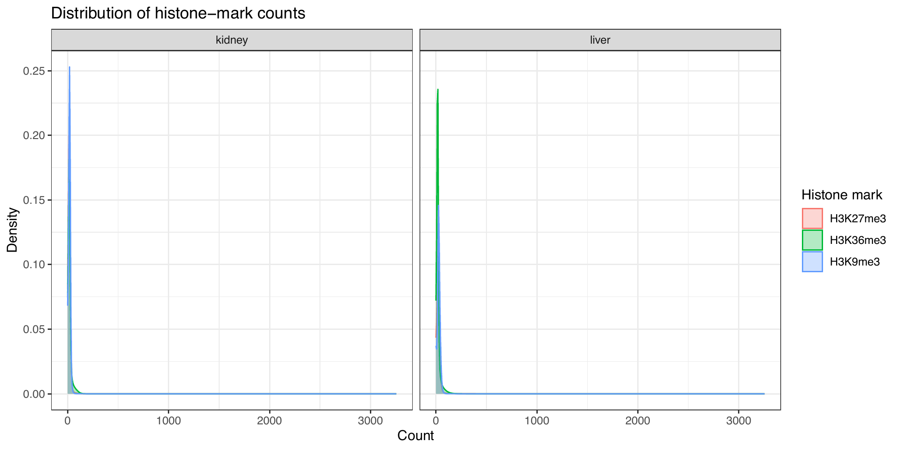

All three marks show a strongly zero-inflated count distribution in both tissues: the vast majority of 2 kb windows carry no reads, so the density is dominated by a spike at zero and the informative signal range is not visible at full scale.

### Plot restricted to counts 0–100

```r
density_plot_xlim100 <- density_plot +
  coord_cartesian(xlim = c(0, 100)) +
  labs(title = "Distribution of histone-mark counts (0-100)")

ggsave(
  filename = "histone_density_xlim100.pdf",
  plot     = density_plot_xlim100,
  width    = 10,
  height   = 5
)
```

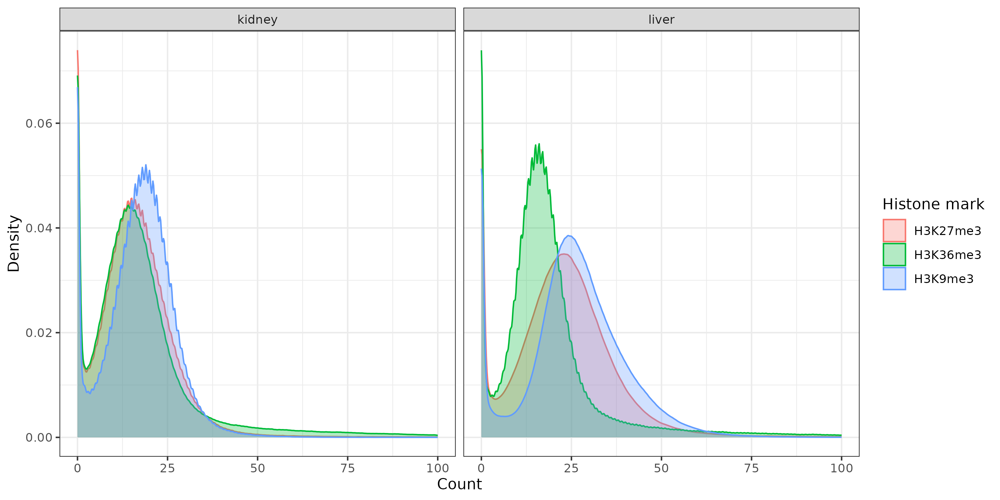

Restricting the view to 0–100 counts resolves the signal-bearing tail: H3K36me3 and H3K27me3 decay more slowly than H3K9me3, consistent with their broader domains, and the kidney and liver panels are near-superimposable, indicating no gross global difference in mark abundance between tissues.

`coord_cartesian()` was used rather than `xlim()` because it zooms the visible range without discarding data points, so the density estimate itself is unchanged.

### Concatenating horizontally

```r
horizontal <- cbind(
  liver[,  c("H3K27me3", "H3K36me3", "H3K9me3")],
  kidney[, c("H3K27me3", "H3K36me3", "H3K9me3")]
)
dim(horizontal)
```

Output:

```
[1] 1362728       6
```

### Rename the header of the new data frame

```r
colnames(horizontal) <- c("H3K27me3_liver",  "H3K36me3_liver",  "H3K9me3_liver",
                          "H3K27me3_kidney", "H3K36me3_kidney", "H3K9me3_kidney")
head(horizontal)
```

Output:

```
  H3K27me3_liver H3K36me3_liver H3K9me3_liver H3K27me3_kidney H3K36me3_kidney
1              0              0             0               0               0
2              0              0             0               0               0
3              0              0             0               0               0
4              0              0             0               0               0
5              0              0             0               0               0
6              0              0             0               0               0
  H3K9me3_kidney
1              0
2              0
3              0
4              0
5              0
6              0
```

### PCA

```r
pca_data   <- horizontal
pca_result <- prcomp(pca_data)
summary(pca_result)
```

Output:

```
Importance of components:
                           PC1     PC2     PC3    PC4     PC5     PC6
Standard deviation     29.4956 22.0458 15.2285 8.0542 6.86203 5.88713
Proportion of Variance  0.5016  0.2802  0.1337 0.0374 0.02715 0.01998
Cumulative Proportion   0.5016  0.7818  0.9155 0.9529 0.98002 1.00000
```

### Variance explained by PC1 and PC2

```r
variance_explained <- (pca_result$sdev^2 / sum(pca_result$sdev^2)) * 100
round(variance_explained, 2)
```

Output: `[1] 50.16 28.02 13.37  3.74  2.71  2.00`

PC1 explains 50.16% of the variance, PC2 explains 28.02%, and together they explain 78.18%.

### Scree plot and cumulative scree plot

```r
pdf("pca_screeplots.pdf", width = 10, height = 5)
par(mfrow = c(1, 2))

plot(variance_explained,
     type = "b", pch = 19, xaxt = "n",
     xlab = "Principal component",
     ylab = "Variance explained (%)",
     main = "Scree plot")
axis(1, at = 1:6, labels = paste0("PC", 1:6))

plot(cumsum(variance_explained),
     type = "b", pch = 19, xaxt = "n", ylim = c(0, 100),
     xlab = "Principal component",
     ylab = "Cumulative variance explained (%)",
     main = "Cumulative scree plot")
axis(1, at = 1:6, labels = paste0("PC", 1:6))

dev.off()
```

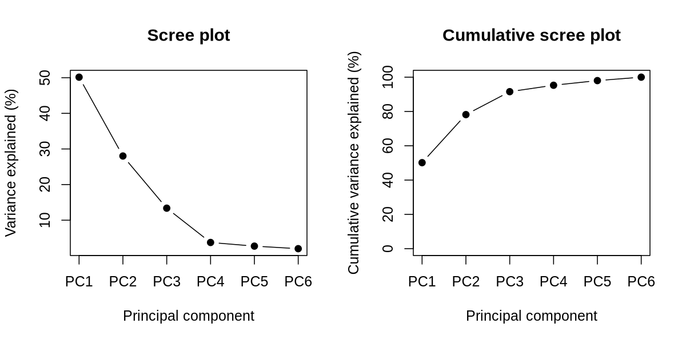

PC1 (50.16%) and PC2 (28.02%) together capture 78.18% of the variance, with a clear elbow after PC2, so two components are sufficient to summarise the six histone-mark count vectors.

### Loadings

```r
loadings <- pca_result$rotation
dim(loadings)
round(loadings, 3)
```

Output:

```
[1] 6 6
                  PC1    PC2    PC3    PC4    PC5    PC6
H3K27me3_liver  0.510  0.661  0.410  0.178 -0.296  0.124
H3K36me3_liver  0.535 -0.534  0.101  0.597  0.247  0.039
H3K9me3_liver   0.260  0.165 -0.799  0.203 -0.316 -0.355
H3K27me3_kidney 0.274  0.279  0.003 -0.269  0.735 -0.484
H3K36me3_kidney 0.498 -0.400  0.096 -0.669 -0.350 -0.108
H3K9me3_kidney  0.249  0.115 -0.418 -0.225  0.298  0.782
```

There are 6 loadings per principal component, one per input variable.

### Plot of PC1 and PC2 loadings

Plot without standardisation:

```r
loadings_df <- data.frame(
  variable = rownames(loadings),
  PC1      = loadings[, "PC1"],
  PC2      = loadings[, "PC2"]
)

loading_plot <- ggplot(
  loadings_df,
  aes(x = PC1, y = PC2, label = variable)) +
  geom_hline(yintercept = 0, linetype = "dashed") +
  geom_vline(xintercept = 0, linetype = "dashed") +
  geom_point(size = 3) +
  geom_text(vjust = -0.7) +
  scale_x_continuous(expand = expansion(mult = c(0.05, 0.25))) +
  scale_y_continuous(expand = expansion(mult = c(0.10, 0.10))) +
  labs(
    x = "PC1 loading (50.16%)",
    y = "PC2 loading (28.02%)"
  ) +
  theme_bw()

loading_plot
ggsave("pca_loadings_pc1_pc2.pdf", loading_plot, width = 8, height = 6)
ggsave("pca_loadings_pc1_pc2.png", loading_plot, width = 8, height = 6, dpi = 300)
```

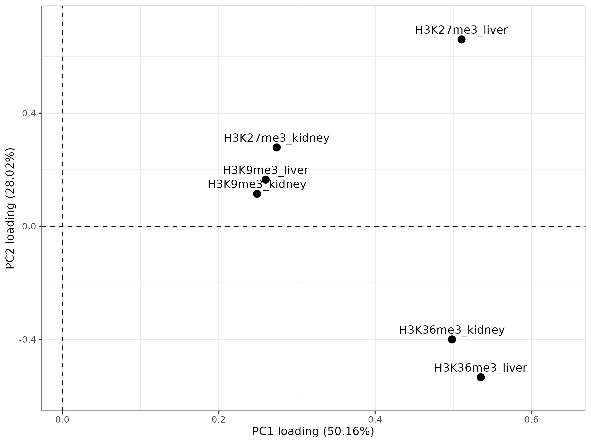

All six variables have positive PC1 loadings, so PC1 reflects overall signal magnitude. PC2 separates the histone marks: H3K27me3 has positive PC2 loadings while H3K36me3 has negative PC2 loadings. The liver and kidney H3K9me3 variables lie close together, indicating similar contributions.

Plot with standardisation (`prcomp(..., scale. = TRUE)`):


After scaling, all six variables contribute more evenly to PC1 while PC2 still separates H3K27me3 (positive) from H3K36me3 (negative), showing that the mark-type split is not an artefact of the differing count variances between the marks.

## GenomicRanges

### Create two GRanges objects from the liver and kidney data frames (columns 4–6)

```r
gr_liver <- GRanges(
  seqnames = liver$Chr,
  ranges   = IRanges(start = liver$Start, end = liver$End),
  H3K27me3 = liver$H3K27me3,
  H3K36me3 = liver$H3K36me3,
  H3K9me3  = liver$H3K9me3
)
gr_kidney <- GRanges(
  seqnames = kidney$Chr,
  ranges   = IRanges(start = kidney$Start, end = kidney$End),
  H3K27me3 = kidney$H3K27me3,
  H3K36me3 = kidney$H3K36me3,
  H3K9me3  = kidney$H3K9me3
)
gr_liver
gr_kidney
```

Output:

```
> gr_liver
GRanges object with 1362728 ranges and 3 metadata columns:
            seqnames            ranges strand |  H3K27me3  H3K36me3   H3K9me3
               <Rle>         <IRanges>  <Rle> | <integer> <integer> <integer>
        [1]     chr1         2000-4000      * |         0         0         0
        [2]     chr1         4000-6000      * |         0         0         0
        [3]     chr1         6000-8000      * |         0         0         0
        [4]     chr1        8000-10000      * |         0         0         0
        [5]     chr1       10000-12000      * |         0         0         0
        ...      ...               ...    ... .       ...       ...       ...
  [1362724]     chrY 91734000-91736000      * |         0         0         0
  [1362725]     chrY 91736000-91738000      * |         0         0         0
  [1362726]     chrY 91738000-91740000      * |         0         0         0
  [1362727]     chrY 91740000-91742000      * |         0         0         0
  [1362728]     chrY 91742000-91744000      * |         0         0         0
  -------
  seqinfo: 21 sequences from an unspecified genome; no seqlengths

> gr_kidney
GRanges object with 1362728 ranges and 3 metadata columns:
            seqnames            ranges strand |  H3K27me3  H3K36me3   H3K9me3
               <Rle>         <IRanges>  <Rle> | <integer> <integer> <integer>
        [1]     chr1         2000-4000      * |         0         0         0
        [2]     chr1         4000-6000      * |         0         0         0
        [3]     chr1         6000-8000      * |         0         0         0
        [4]     chr1        8000-10000      * |         0         0         0
        [5]     chr1       10000-12000      * |         0         0         0
        ...      ...               ...    ... .       ...       ...       ...
  [1362724]     chrY 91734000-91736000      * |         0         0         0
  [1362725]     chrY 91736000-91738000      * |         0         0         0
  [1362726]     chrY 91738000-91740000      * |         0         0         0
  [1362727]     chrY 91740000-91742000      * |         0         0         0
  [1362728]     chrY 91742000-91744000      * |         0         0         0
  -------
  seqinfo: 21 sequences from an unspecified genome; no seqlengths
```

### Total number of bases covered

```r
sum(width(gr_liver))
sum(width(gr_kidney))
```

Output:

```
[1] 2726818728
[1] 2726818728
```

### Subset the object to chr2

```r
gr_liver_chr2 <- gr_liver[seqnames(gr_liver) == "chr2"]
gr_liver_chr2
```

Output:

```
GRanges object with 91055 ranges and 3 metadata columns:
          seqnames              ranges strand |  H3K27me3  H3K36me3   H3K9me3
             <Rle>           <IRanges>  <Rle> | <integer> <integer> <integer>
      [1]     chr2           2000-4000      * |         0         0         0
      [2]     chr2           4000-6000      * |         0         0         0
      [3]     chr2           6000-8000      * |         0         0         0
      [4]     chr2          8000-10000      * |         0         0         0
      [5]     chr2         10000-12000      * |         0         0         0
      ...      ...                 ...    ... .       ...       ...       ...
  [91051]     chr2 182102000-182104000      * |         0         0         0
  [91052]     chr2 182104000-182106000      * |         0         0         0
  [91053]     chr2 182106000-182108000      * |         0         0         0
  [91054]     chr2 182108000-182110000      * |         0         0         0
  [91055]     chr2 182110000-182112000      * |         0         0         0
  -------
  seqinfo: 21 sequences from an unspecified genome; no seqlengths
```

### Shift the object's ranges 100 bp upstream

```r
gr_liver_shifted <- shift(gr_liver, -100)
gr_liver_shifted
```

Output:

```
GRanges object with 1362728 ranges and 3 metadata columns:
            seqnames            ranges strand |  H3K27me3  H3K36me3   H3K9me3
               <Rle>         <IRanges>  <Rle> | <integer> <integer> <integer>
        [1]     chr1         1900-3900      * |         0         0         0
        [2]     chr1         3900-5900      * |         0         0         0
        [3]     chr1         5900-7900      * |         0         0         0
        [4]     chr1         7900-9900      * |         0         0         0
        [5]     chr1        9900-11900      * |         0         0         0
        ...      ...               ...    ... .       ...       ...       ...
  [1362724]     chrY 91733900-91735900      * |         0         0         0
  [1362725]     chrY 91735900-91737900      * |         0         0         0
  [1362726]     chrY 91737900-91739900      * |         0         0         0
  [1362727]     chrY 91739900-91741900      * |         0         0         0
  [1362728]     chrY 91741900-91743900      * |         0         0         0
  -------
  seqinfo: 21 sequences from an unspecified genome; no seqlengths
```

### Overlaps between the shifted liver object and the kidney object

```r
overlaps_shifted <- findOverlaps(gr_liver_shifted, gr_kidney)
length(overlaps_shifted)
```

Output:

```
[1] 2725435
```

The hit count is approximately twice the number of ranges (2 x 1,362,728): because the windows are contiguous, shifting each one by 100 bp makes it overlap both its own original window and the neighbouring window, so nearly every range now produces two hits instead of one.

### Make a GRangesList

```r
grl <- GRangesList(liver = gr_liver, kidney = gr_kidney)
grl
```

Output:

```
GRangesList object of length 2:
$liver
GRanges object with 1362728 ranges and 3 metadata columns:
            seqnames            ranges strand |  H3K27me3  H3K36me3   H3K9me3
               <Rle>         <IRanges>  <Rle> | <integer> <integer> <integer>
        [1]     chr1         2000-4000      * |         0         0         0
        ...      ...               ...    ... .       ...       ...       ...
  [1362728]     chrY 91742000-91744000      * |         0         0         0
  -------
  seqinfo: 21 sequences from an unspecified genome; no seqlengths

$kidney
GRanges object with 1362728 ranges and 3 metadata columns:
            seqnames            ranges strand |  H3K27me3  H3K36me3   H3K9me3
               <Rle>         <IRanges>  <Rle> | <integer> <integer> <integer>
        [1]     chr1         2000-4000      * |         0         0         0
        ...      ...               ...    ... .       ...       ...       ...
  [1362728]     chrY 91742000-91744000      * |         0         0         0
  -------
  seqinfo: 21 sequences from an unspecified genome; no seqlengths
```

---

# Part 1 — Running the nf-core/atacseq pipeline

## 1. Organise the raw data

### a. List of raw FASTQ files

```bash
ls -la /vol/COMPEPIWS/data/reduced/ATAC-seq/
```

Output:

```
kidney_14.5_ATAC_1_R1.fastq.gz   kidney_14.5_ATAC_1_R2.fastq.gz
kidney_14.5_ATAC_2_R1.fastq.gz   kidney_14.5_ATAC_2_R2.fastq.gz
kidney_15.5_ATAC_1_R1.fastq.gz   kidney_15.5_ATAC_1_R2.fastq.gz
kidney_15.5_ATAC_2_R1.fastq.gz   kidney_15.5_ATAC_2_R2.fastq.gz
liver_14.5_ATAC_1_R1.fastq.gz    liver_14.5_ATAC_1_R2.fastq.gz
liver_14.5_ATAC_2_R1.fastq.gz    liver_14.5_ATAC_2_R2.fastq.gz
liver_15.5_ATAC_1_R1.fastq.gz    liver_15.5_ATAC_1_R2.fastq.gz
liver_15.5_ATAC_2_R1.fastq.gz    liver_15.5_ATAC_2_R2.fastq.gz
```

### b. Files per cell type, per timepoint, per replicate

2 cell types (kidney, liver) x 2 timepoints (E14.5, E15.5) x 2 replicates = 8 samples, each with 2 FASTQ files (R1 and R2) = 16 files in total.

## 2. Create a samplesheet

### a. Working directory

```bash
cd /vol/COMPEPIWS/groups/atacseq1/tasks
mkdir -p nextflow_run
cd nextflow_run
```

### b. Samplesheet preparation

```bash
cat > samplesheet.csv << 'EOF'
sample,fastq_1,fastq_2,replicate
kidney_14_5,/vol/COMPEPIWS/data/reduced/ATAC-seq/kidney_14.5_ATAC_1_R1.fastq.gz,/vol/COMPEPIWS/data/reduced/ATAC-seq/kidney_14.5_ATAC_1_R2.fastq.gz,1
kidney_14_5,/vol/COMPEPIWS/data/reduced/ATAC-seq/kidney_14.5_ATAC_2_R1.fastq.gz,/vol/COMPEPIWS/data/reduced/ATAC-seq/kidney_14.5_ATAC_2_R2.fastq.gz,2
kidney_15_5,/vol/COMPEPIWS/data/reduced/ATAC-seq/kidney_15.5_ATAC_1_R1.fastq.gz,/vol/COMPEPIWS/data/reduced/ATAC-seq/kidney_15.5_ATAC_1_R2.fastq.gz,1
kidney_15_5,/vol/COMPEPIWS/data/reduced/ATAC-seq/kidney_15.5_ATAC_2_R1.fastq.gz,/vol/COMPEPIWS/data/reduced/ATAC-seq/kidney_15.5_ATAC_2_R2.fastq.gz,2
liver_14_5,/vol/COMPEPIWS/data/reduced/ATAC-seq/liver_14.5_ATAC_1_R1.fastq.gz,/vol/COMPEPIWS/data/reduced/ATAC-seq/liver_14.5_ATAC_1_R2.fastq.gz,1
liver_14_5,/vol/COMPEPIWS/data/reduced/ATAC-seq/liver_14.5_ATAC_2_R1.fastq.gz,/vol/COMPEPIWS/data/reduced/ATAC-seq/liver_14.5_ATAC_2_R2.fastq.gz,2
liver_15_5,/vol/COMPEPIWS/data/reduced/ATAC-seq/liver_15.5_ATAC_1_R1.fastq.gz,/vol/COMPEPIWS/data/reduced/ATAC-seq/liver_15.5_ATAC_1_R2.fastq.gz,1
liver_15_5,/vol/COMPEPIWS/data/reduced/ATAC-seq/liver_15.5_ATAC_2_R1.fastq.gz,/vol/COMPEPIWS/data/reduced/ATAC-seq/liver_15.5_ATAC_2_R2.fastq.gz,2
EOF
```

### Is the data single-end or paired-end?

The data are paired-end. R1 (forward) and R2 (reverse) together form a read pair mapping to the same original DNA fragment, sequenced from opposite ends. Paired-end reads allow the exact fragment length to be computed, which is essential in ATAC-seq because the fragment-size distribution (sub-nucleosomal, mono-, di-nucleosomal peaks) is itself a core quality metric.

## 3. Run the ATAC-seq pipeline

### a. Config file

```bash
cat /vol/COMPEPIWS/pipelines/config/atacseq.json
```

Output:

```json
{
  "fasta": "/vol/COMPEPIWS/pipelines/references/mm10_reduced_chr18_chr19.fa",
  "gtf": "/vol/COMPEPIWS/pipelines/references/mm10.reduced.refGene.gtf",
  "gene_bed": "/vol/COMPEPIWS/pipelines/references/mm10_reduced_chr18_chr19_genes.bed",
  "blacklist":"/vol/COMPEPIWS/data/annotation/mm10-blacklist.v2.reduced.bed",

  "save_reference": false,
  "narrow_peak": true,
  "macs_gsize": 145658490,
  "save_macs_pileup": true,
  "fragment_size": 200,

  "skip_preseq":true,
  "skip_plot_profile":true,
  "skip_plot_fingerprint":true,

  "max_memory":"64.GB",
  "max_cpus": 6,
  "max_time":"2.h"
}
```

### i. Which steps of the pipeline are skipped?

Three steps are switched off:

| Parameter | Step skipped | What it normally does |
|---|---|---|
| `skip_preseq: true` | preseq | Extrapolates library complexity, i.e. how many additional unique fragments would be recovered from deeper sequencing. |
| `skip_plot_profile: true` | deepTools `plotProfile` | Produces metagene / TSS-centred signal profile plots across gene bodies. |
| `skip_plot_fingerprint: true` | deepTools `plotFingerprint` | Plots the cumulative read-count distribution to assess signal-to-background enrichment. |

All three are optional QC visualisations. They are skipped here to shorten runtime, and because the reduced chr18/chr19 dataset with only ~1.7–4.4 M reads per sample gives limited value for complexity extrapolation.

### ii. Why is the blacklist file used? What do these regions represent?

The blacklist excludes genomic regions that show high signal in essentially every sample regardless of biological condition. These are typically repetitive, low-mappability or high-copy-number regions (satellite repeats, rDNA, centromeric and telomeric regions) where reads pile up artefactually. Excluding them prevents false-positive peak calls and prevents these artefacts from dominating the downstream differential analysis. The file is supplied in BED format and is used to filter alignments before peak calling.

### b. Load the core conda environment

```bash
source /vol/COMPEPIWS/conda/miniconda3/bin/activate /vol/COMPEPIWS/conda/miniconda3/envs/core
cd /vol/COMPEPIWS/groups/atacseq1/tasks/nextflow_run
ls
```

### c. Run the pipeline

```bash
nextflow run nf-core/atacseq -r 2.1.2 -profile singularity \
  --input samplesheet.csv \
  --outdir /vol/COMPEPIWS/groups/atacseq1/tasks/nextflow_run/results \
  -params-file /vol/COMPEPIWS/pipelines/config/atacseq.json
```

Path to the output directory:

```
/vol/COMPEPIWS/groups/atacseq1/tasks/nextflow_run/results
```

### Pipeline execution report

The pipeline completed successfully in 14 minutes; all 310 tasks completed.


The task using the most CPU was `BWA_MEM` at 608.7% CPU. `SAMTOOLS_SORT` also used substantial CPU (530%) but less than `BWA_MEM`.


The most memory-intensive task was `PICARD_MARKDUPLICATES` at 15.79 GB.


The longest-running tasks were `BWA_INDEX` (2.5 min) and `BWA_MEM` (1.8 min), so the alignment stage dominated wall-clock time, with reference indexing the single longest step.

## 4. Quality control

```bash
ls /vol/COMPEPIWS/groups/atacseq1/tasks/nextflow_run/results/fastqc/
```

Output:

```
kidney_14_5_REP1_T1_1_fastqc.html  liver_14_5_REP1_T1_2_fastqc.html
kidney_14_5_REP1_T1_2_fastqc.html  liver_14_5_REP2_T1_1_fastqc.html
kidney_14_5_REP2_T1_1_fastqc.html  liver_14_5_REP2_T1_2_fastqc.html
kidney_14_5_REP2_T1_2_fastqc.html  liver_15_5_REP1_T1_1_fastqc.html
kidney_15_5_REP1_T1_1_fastqc.html  liver_15_5_REP1_T1_2_fastqc.html
kidney_15_5_REP1_T1_2_fastqc.html  liver_15_5_REP2_T1_1_fastqc.html
kidney_15_5_REP2_T1_1_fastqc.html  liver_15_5_REP2_T1_2_fastqc.html
kidney_15_5_REP2_T1_2_fastqc.html  zips
liver_14_5_REP1_T1_1_fastqc.html
```

### a. Read length used for sequencing

The read length is 51 bp across all files. The lower bound of the reported length range differs between files because low-quality bases are trimmed off.

### b. Per-base sequence quality

Per-base sequence quality displays the distribution of Phred scores per cycle, i.e. the probability that a base was called incorrectly. All 16 read files pass this module after trimming.

### c. Per-base sequence content

Per-base sequence content shows the percentage of each DNA base at every read position. The module fails when the difference between complementary base pairs exceeds 20%. In ATAC-seq a failure at the 5' end is expected, because the Tn5 transposase has a sequence-insertion bias; adapter read-through from very short fragments can contribute as well.

## 5. Aligned read files (BAM)

```bash
ls /vol/COMPEPIWS/groups/atacseq1/tasks/nextflow_run/results/bwa/merged_library/
```

Output:

```
ataqv                                    liver_14_5_REP1.mLb.clN.sorted.bam.bai
bigwig                                   liver_14_5_REP2.mLb.clN.sorted.bam
kidney_14_5_REP1.mLb.clN.sorted.bam      liver_14_5_REP2.mLb.clN.sorted.bam.bai
kidney_14_5_REP1.mLb.clN.sorted.bam.bai  liver_15_5_REP1.mLb.clN.sorted.bam
kidney_14_5_REP2.mLb.clN.sorted.bam      liver_15_5_REP1.mLb.clN.sorted.bam.bai
kidney_14_5_REP2.mLb.clN.sorted.bam.bai  liver_15_5_REP2.mLb.clN.sorted.bam
kidney_15_5_REP1.mLb.clN.sorted.bam      liver_15_5_REP2.mLb.clN.sorted.bam.bai
kidney_15_5_REP1.mLb.clN.sorted.bam.bai  macs2
kidney_15_5_REP2.mLb.clN.sorted.bam      picard_metrics
kidney_15_5_REP2.mLb.clN.sorted.bam.bai  samtools_stats
liver_14_5_REP1.mLb.clN.sorted.bam
```

### a. samtools flagstat for each BAM file

```bash
source /vol/COMPEPIWS/conda/miniconda3/bin/activate /vol/COMPEPIWS/conda/miniconda3/envs/core
cd /vol/COMPEPIWS/groups/atacseq1/tasks/nextflow_run/results/bwa/merged_library/
mkdir -p flagstat_results
for bam in *.bam; do
  echo "$bam"
  samtools flagstat "$bam" | tee flagstat_results/"${bam%.bam}".flagstat.txt
  echo ""
done
```

Output:

| Sample | Total reads | Mapped | Mapped % | Properly paired | Duplicates |
|---|---|---|---|---|---|
| kidney_14_5_REP1 | 3,053,702 | 3,053,702 | 100.00% | 3,052,528 (99.96%) | 0 |
| kidney_14_5_REP2 | 3,531,622 | 3,531,622 | 100.00% | 3,531,582 (100.00%) | 0 |
| kidney_15_5_REP1 | 3,462,304 | 3,462,304 | 100.00% | 3,462,290 (100.00%) | 0 |
| kidney_15_5_REP2 | 3,892,596 | 3,892,596 | 100.00% | 3,892,572 (100.00%) | 0 |
| liver_14_5_REP1 | 1,773,908 | 1,773,908 | 100.00% | 1,773,886 (100.00%) | 0 |
| liver_14_5_REP2 | 4,422,848 | 4,422,848 | 100.00% | 4,422,788 (100.00%) | 0 |
| liver_15_5_REP1 | 2,832,640 | 2,832,640 | 100.00% | 2,832,606 (100.00%) | 0 |
| liver_15_5_REP2 | 1,712,552 | 1,712,552 | 100.00% | 1,712,528 (100.00%) | 0 |

The mapping rate is 100% across all samples. These are the merged-library, filtered BAMs, from which unmapped reads and duplicates have already been removed by the pipeline, which is why the duplicate count is zero at this stage.

## 6. Peak calling results

```bash
cd /vol/COMPEPIWS/groups/atacseq1/tasks/nextflow_run/results/bwa/merged_library/macs2/narrow_peak/
ls -la
```

Output (excerpt):

```
total 1244484
drwxrwsr-x 4 divyashree_05 atacseq1      4096 Aug  3 07:22 .
drwxrwsr-x 3 divyashree_05 atacseq1      4096 Aug  3 07:20 ..
drwxrwsr-x 3 divyashree_05 atacseq1      4096 Aug  3 07:23 consensus
-rw-rw-r-- 1 divyashree_05 atacseq1  89773222 Aug  3 07:21 kidney_14_5_REP1.mLb.clN_control_lambda.bdg
-rw-rw-r-- 1 divyashree_05 atacseq1    305334 Aug  3 07:21 kidney_14_5_REP1.mLb.clN_peaks.annotatePeaks.txt
-rw-rw-r-- 1 divyashree_05 atacseq1    178207 Aug  3 07:21 kidney_14_5_REP1.mLb.clN_peaks.narrowPeak
-rw-rw-r-- 1 divyashree_05 atacseq1    192487 Aug  3 07:21 kidney_14_5_REP1.mLb.clN_peaks.xls
-rw-rw-r-- 1 divyashree_05 atacseq1    129265 Aug  3 07:21 kidney_14_5_REP1.mLb.clN_summits.bed
-rw-rw-r-- 1 divyashree_05 atacseq1  89219881 Aug  3 07:21 kidney_14_5_REP1.mLb.clN_treat_pileup.bdg
```

### a. Number of peaks called per sample

```bash
for f in *.narrowPeak; do echo -n "$f : "; wc -l < "$f"; done
```

Output:

```
kidney_14_5_REP1.mLb.clN_peaks.narrowPeak : 1959
kidney_14_5_REP2.mLb.clN_peaks.narrowPeak : 3415
kidney_15_5_REP1.mLb.clN_peaks.narrowPeak : 2983
kidney_15_5_REP2.mLb.clN_peaks.narrowPeak : 3257
liver_14_5_REP1.mLb.clN_peaks.narrowPeak  : 1456
liver_14_5_REP2.mLb.clN_peaks.narrowPeak  : 2306
liver_15_5_REP1.mLb.clN_peaks.narrowPeak  : 2011
liver_15_5_REP2.mLb.clN_peaks.narrowPeak  : 1684
```

### b. Difference between the `*_peaks` and `*_summits` files

`*_peaks` (`.narrowPeak`, `.xls`) defines the whole accessible region of each peak; every row gives the peak start and end coordinates together with fold enrichment, p-value and q-value.

`*_summits` (`.bed`) gives the single base-pair position of maximum signal within each peak, which is the coordinate normally used for motif and footprint analyses.

## 7. MultiQC report

```bash
ls /vol/COMPEPIWS/groups/atacseq1/tasks/nextflow_run/results/multiqc/narrow_peak/
```

Output:

```
multiqc_data  multiqc_plots  multiqc_report.html
```

### a. Highest read duplication rate

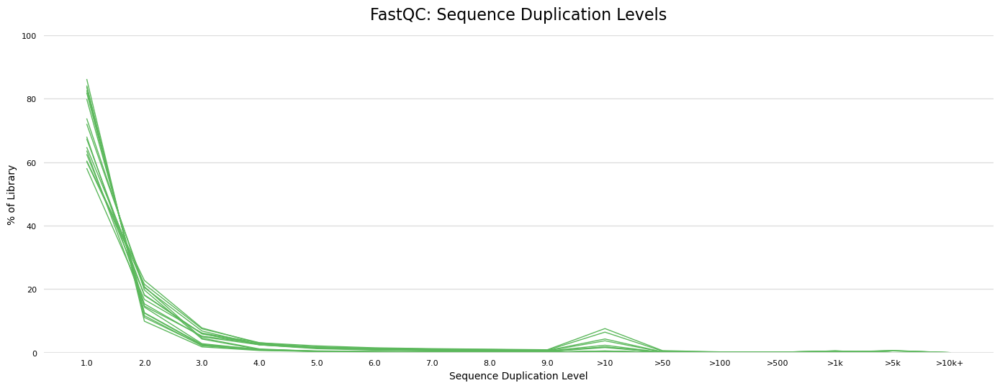

`liver_14_5_REP2_T1_1` has the highest duplication rate at 29.3%.

### b. Most peaks called

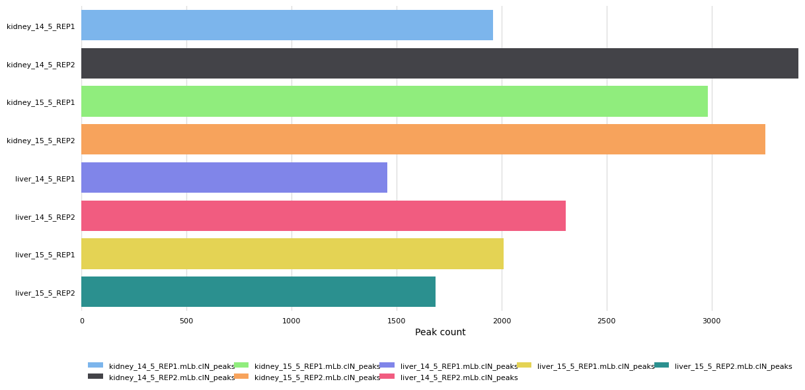

`kidney_14_5_REP2` has the most peaks at 3,415, consistent with it also being one of the deeper-sequenced samples.

### c. Lowest FRiP score


`kidney_14_5_REP1` has the lowest FRiP at 0.1 (10%), i.e. the highest background-to-signal ratio of the eight samples, but still within the range usually tolerated for ATAC-seq.

### d. Percentage range of peaks overlapping promoters

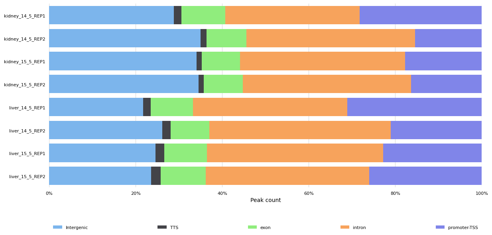

| Sample | % peaks overlapping promoters |
|---|---|
| kidney_14_5_REP1 | 28.3% |
| kidney_14_5_REP2 | 15.4% (lowest) |
| kidney_15_5_REP1 | 17.7% |
| kidney_15_5_REP2 | 16.4% |
| liver_14_5_REP1 | 31.1% (highest) |
| liver_14_5_REP2 | 21.0% |
| liver_15_5_REP1 | 22.8% |
| liver_15_5_REP2 | 26.1% |

Promoter overlap ranges from 15.4% to 31.1%, so in every sample the clear majority of accessible sites are distal rather than promoter-proximal.

### e. Difference between the "MERGED LIB" and "MERGED REP" sections

**MERGED LIB** reports per-replicate results after merging sequencing libraries of the same replicate, so it contains the 8 individual samples (kidney_14_5_REP1, kidney_14_5_REP2, liver_14_5_REP1, liver_14_5_REP2, and so on).

**MERGED REP** reports results after biological replicates have been merged into one dataset per condition, so it contains 4 groups (kidney_14_5, kidney_15_5, liver_14_5, liver_15_5).

---

# Part 2 — Integrative analysis using ChrAccR

## Running the ChrAccR pipeline

Make a new directory:

```bash
mkdir -p /vol/COMPEPIWS/groups/atacseq1/tasks/chraccr
cd /vol/COMPEPIWS/groups/atacseq1/tasks/chraccr
```

Prepare the sample annotation sheet:

```bash
BAMDIR="/vol/COMPEPIWS/groups/atacseq1/tasks/nextflow_run/results/bwa/merged_library"

{
printf "sampleId\ttissue\ttime\treplicate\tbamFile\n"
printf "kidney_14_5_REP1\tkidney\t14.5\t1\t%s/kidney_14_5_REP1.mLb.clN.sorted.bam\n" "$BAMDIR"
printf "kidney_14_5_REP2\tkidney\t14.5\t2\t%s/kidney_14_5_REP2.mLb.clN.sorted.bam\n" "$BAMDIR"
printf "kidney_15_5_REP1\tkidney\t15.5\t1\t%s/kidney_15_5_REP1.mLb.clN.sorted.bam\n" "$BAMDIR"
printf "kidney_15_5_REP2\tkidney\t15.5\t2\t%s/kidney_15_5_REP2.mLb.clN.sorted.bam\n" "$BAMDIR"
printf "liver_14_5_REP1\tliver\t14.5\t1\t%s/liver_14_5_REP1.mLb.clN.sorted.bam\n" "$BAMDIR"
printf "liver_14_5_REP2\tliver\t14.5\t2\t%s/liver_14_5_REP2.mLb.clN.sorted.bam\n" "$BAMDIR"
printf "liver_15_5_REP1\tliver\t15.5\t1\t%s/liver_15_5_REP1.mLb.clN.sorted.bam\n" "$BAMDIR"
printf "liver_15_5_REP2\tliver\t15.5\t2\t%s/liver_15_5_REP2.mLb.clN.sorted.bam\n" "$BAMDIR"
} > sample_annotation.tsv
```

### Activate the conda environment and start R

```bash
source /vol/COMPEPIWS/conda/miniconda3/bin/activate
conda activate core
R
```

### Load the required R packages

```r
library(ChrAccR)
library(GenomicRanges)
```

### Configure the differential analysis

```r
getConfigElement("differentialColumns")
setConfigElement("differentialColumns", "tissue")
getConfigElement("differentialColumns")
```

Output before configuration: `NULL`
Output after configuration: `[1] "tissue"`

### Load the supplied region sets

```r
regionSetList <- readRDS("/vol/COMPEPIWS/data/annotation/regionSetList.rds")

class(regionSetList)
names(regionSetList)
sapply(regionSetList, length)
sapply(regionSetList, class)
```

Output:

```
[1] "list"
[1] "tiling" "promoter"
   tiling promoter
  5451088    21963
   tiling  promoter
"GRanges" "GRanges"
```

**Which region sets are included?** Tiling regions (5,451,088 genome-wide windows) and promoter regions (21,963).

**Why are these region sets interesting for chromatin accessibility?** The tiling regions divide the genome into fixed windows, giving an unbiased genome-wide view of accessibility that is independent of where peaks were called. The promoter regions are anchored on transcription start sites, so their accessibility can be related directly to whether the corresponding gene is likely to be active.

### Add the consensus peaks to the region-set list

```r
library(rtracklayer)

consensusPeakFile <- paste0(
  "/vol/COMPEPIWS/groups/atacseq1/tasks/nextflow_run/",
  "results/bwa/merged_library/macs2/narrow_peak/",
  "consensus/consensus_peaks.mLb.clN.bed"
)

file.exists(consensusPeakFile)
consensusPeaks <- import(consensusPeakFile)

class(consensusPeaks)
length(consensusPeaks)
head(consensusPeaks)

regionSetList$consensusPeaks <- consensusPeaks

names(regionSetList)
sapply(regionSetList, length)
sapply(regionSetList, class)
```

Output:

```
[1] "GRanges"
[1] 6259

[1] "tiling" "promoter" "consensusPeaks"

        tiling       promoter consensusPeaks
       5451088          21963           6259

        tiling       promoter consensusPeaks
     "GRanges"      "GRanges"      "GRanges"
```

### Load the sample annotation table

```r
sampleAnnot <- read.table(
  "sample_annotation.tsv",
  header = TRUE,
  sep = "\t",
  stringsAsFactors = FALSE
)

sampleAnnot
str(sampleAnnot)
file.exists(sampleAnnot$bamFile)
```

Output: `[1] TRUE TRUE TRUE TRUE TRUE TRUE TRUE TRUE`

### Run the ChrAccR pipeline

```r
run_atac(
  "ChrAccR_analysis",
  "bamFile",
  sampleAnnot,
  genome      = "mm10",
  sampleIdCol = "sampleId",
  regionSets  = regionSetList
)
```

## Interpretation of the ChrAccR report

### Summary

#### a. Number of regions annotated with chromatin accessibility

| Region set | Regions annotated |
|---|---|
| tiling | 280,370 |
| promoter | 1,216 |
| consensusPeaks | 6,259 |

The tiling and promoter counts are much smaller than the region sets that were supplied (5,451,088 and 21,963 respectively) because the supplied sets are genome-wide, whereas the data are restricted to the reduced chr18/chr19 reference. Only regions falling on these two chromosomes and carrying insertion signal are retained.

#### b. Samples with a low number of fragments

| Sample | Fragments |
|---|---|
| kidney_14_5_REP1 | 1,526,264 |
| kidney_14_5_REP2 | 1,765,791 |
| kidney_15_5_REP1 | 1,731,145 |
| kidney_15_5_REP2 | 1,946,286 |
| liver_14_5_REP1 | 886,943 (second lowest) |
| liver_14_5_REP2 | 2,211,394 (highest) |
| liver_15_5_REP1 | 1,416,303 |
| liver_15_5_REP2 | 856,264 (lowest) |

`liver_15_5_REP2` has the lowest fragment number (856,264) and `liver_14_5_REP1` the second lowest (886,943). Both are roughly half the depth of the deepest sample, `liver_14_5_REP2`.

#### c. Why is there a second hump downstream of the TSS in the TSS profile plots?

The primary peak sits at the nucleosome-depleted region (NDR) immediately at the TSS, where Tn5 has free access to the DNA. The +1 nucleosome directly downstream protects its DNA from transposition, producing the dip. The linker DNA beyond that nucleosome is accessible again, producing the second hump. The pattern reflects periodic nucleosome phasing around the NDR, which is flanked by the -1 and +1 nucleosomes.

#### d. Are there any samples with bad TSS enrichment? Which sample has the lowest score?

| Sample | TSS enrichment score |
|---|---|
| kidney_14_5_REP1 | 8.22 (lowest) |
| kidney_14_5_REP2 | 11.92 |
| kidney_15_5_REP1 | 10.67 |
| kidney_15_5_REP2 | 11.34 |
| liver_14_5_REP1 | 20.76 |
| liver_14_5_REP2 | 26.17 (highest) |
| liver_15_5_REP1 | 23.71 |
| liver_15_5_REP2 | 21.48 |

No sample is bad. The lowest is `kidney_14_5_REP1` at 8.22, still well above the usual acceptability threshold of ~6, and all four liver samples exceed 20. The kidney samples are systematically lower than the liver samples, matching their lower FRiP scores.

### Filtering

#### a. How many regions of each type were removed, and why?

| Region set | Before filtering | After filtering | Regions removed |
|---|---|---|---|
| tiling | 280,370 | 276,356 | 4,014 |
| promoter | 1,216 | 1,216 | 0 |
| consensusPeaks | 6,259 | 6,256 | 3 |

Two filtering steps were applied:

1. **Low coverage** — regions with a coverage below 1 in more than 25% of samples were removed.
2. **Mitochondrial regions** — regions and fragments on chrM were removed.

### Normalization

#### a. What type of normalization was applied?

Quantile normalization. It forces every sample's count distribution onto a single common reference distribution, so all samples end up with identical marginal distributions and differences in sequencing depth and other technical variation are removed.

#### b. What effect did normalization have on the samples with lower fragment numbers?

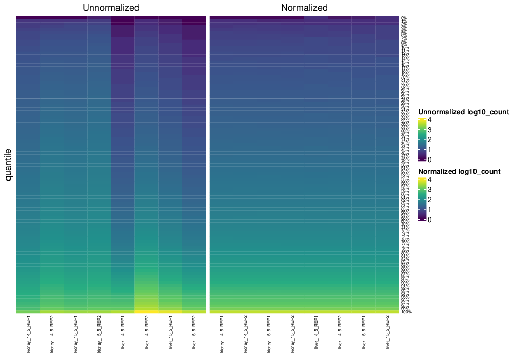

Quantile normalization pulls the low-fragment samples (`liver_15_5_REP2`, `liver_14_5_REP1`) up onto the common reference distribution: the normalized black diagonal sits above the unnormalized grey diagonal, so the curves for all eight samples become superimposable and the depth-driven offset visible in the unnormalized panel is removed.

### Exploratory analysis

#### a. Which region set best discriminates between liver and kidney samples?


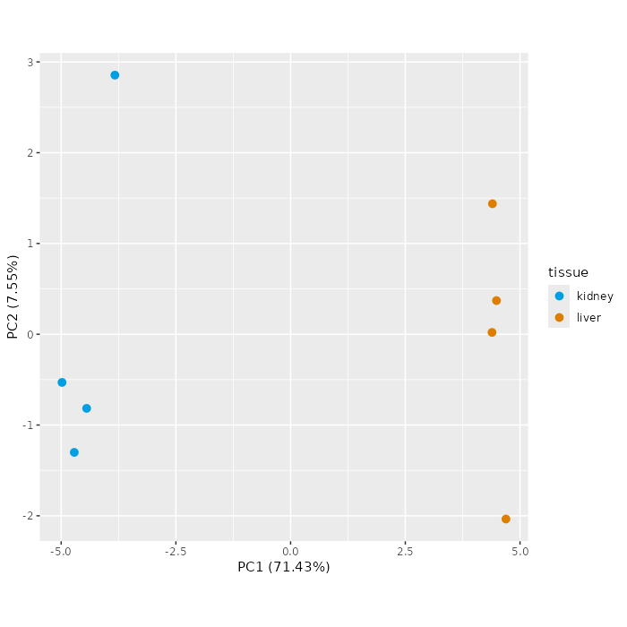
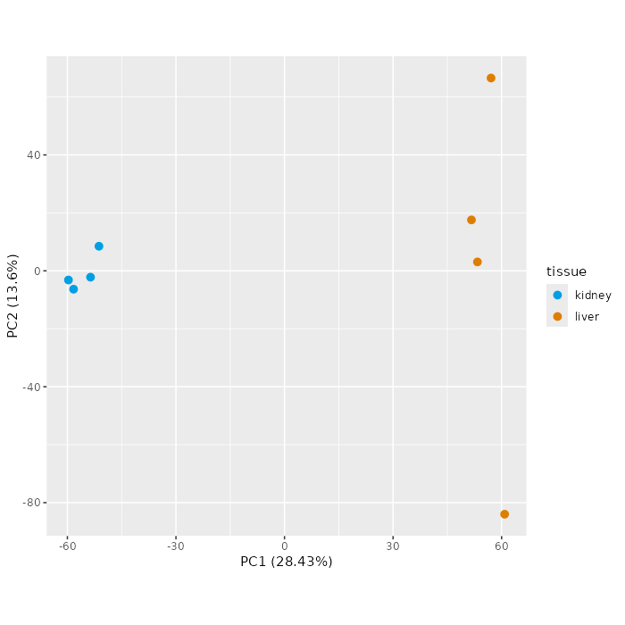

| Region set | PC1 variance | Separation |
|---|---|---|
| consensusPeaks | 79.69% | tight clusters, large PC1 gap |
| promoter | 71.43% | tight clusters |
| tiling | 28.43% | scattered, low variance |

`consensusPeaks` discriminates best. Its PCA shows the cleanest separation: kidney samples cluster tightly around PC1 = -20, liver samples around PC1 = +20, and PC1 explains 79.69% of total variance, the highest of the three region sets. This is expected, since consensus peaks are exactly the regions where accessibility signal is concentrated, whereas genome-wide tiles are dominated by low-signal background.

#### b. Can the samples be separated based on developmental time?

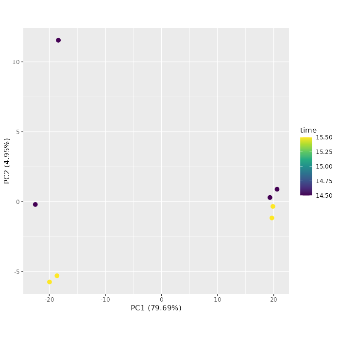
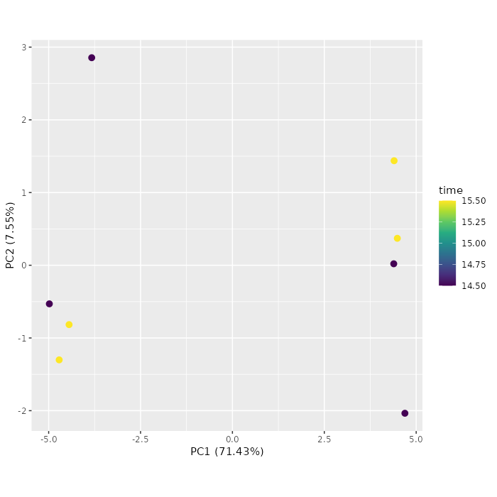
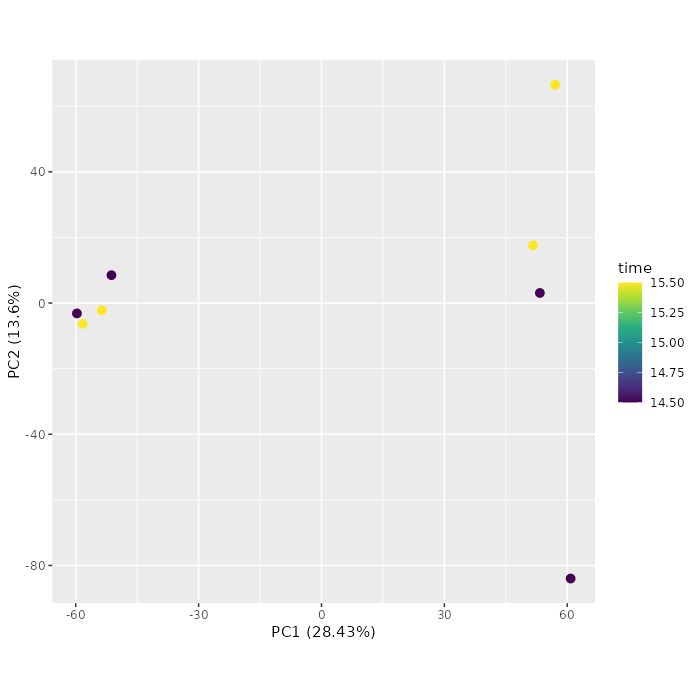

No. The kidney cluster contains one E14.5 and one E15.5 sample sitting almost on top of each other, and the liver cluster mixes both timepoints across a wide PC1/PC2 range with no consistent grouping by colour. Tissue, not developmental time, is the dominant source of variation.

#### c. Which TF motifs show the largest variance across all samples?

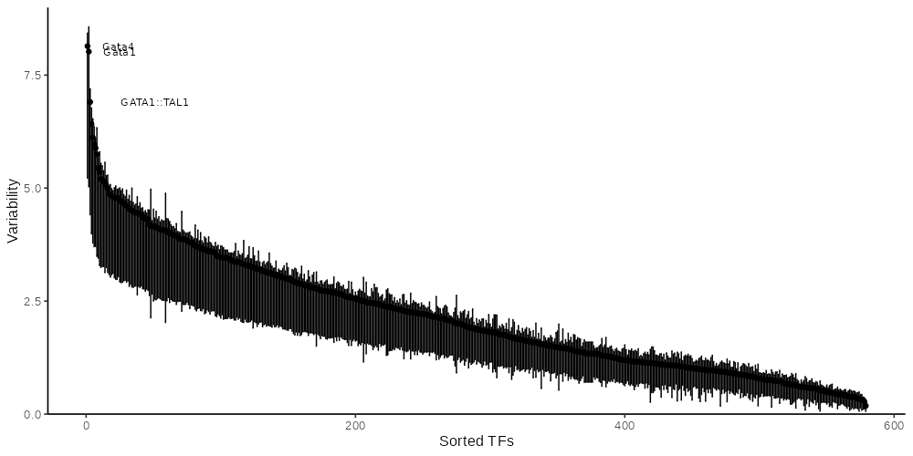

| Rank | Motif |
|---|---|
| 1 | GATA4 |
| 2 | GATA1 |
| 3 | GATA1::TAL1 |

The ChrAccR report plots the top 3 motifs; the `computeVariability()` call performed separately in section 5 below returns the top 5 (Gata4, Gata1, GATA6, GATA3, GATA1::TAL1). All are GATA-family factors, consistent with a liver-versus-kidney contrast at these stages: GATA4 and GATA6 are hepatocyte regulators, while GATA1 and the GATA1::TAL1 heterodimer are erythroid factors, reflecting the fact that the E14.5–E15.5 fetal liver is the main site of definitive erythropoiesis and therefore contains a large erythroid-progenitor population.

### Differential analysis

#### a. Peaks in which tissue are generally more accessible?

```bash
cd /vol/COMPEPIWS/groups/atacseq1/tasks/chraccr/ChrAccR_analysis/reports/differential_data

echo "diffTab_1_tiling.tsv"
awk -F'\t' 'NR>1 && $15<0.01 && $11>3{k++} NR>1 && $15<0.01 && $11<-3{l++} END{print "Kidney:", k+0, " Liver:", l+0}' diffTab_1_tiling.tsv

echo "diffTab_1_consensuspeaks.tsv"
awk -F'\t' 'NR>1 && $15<0.01 && $11>3{k++} NR>1 && $15<0.01 && $11<-3{l++} END{print "Kidney:", k+0, " Liver:", l+0}' diffTab_1_consensuspeaks.tsv

echo "diffTab_1_promoter.tsv"
awk -F'\t' 'NR>1 && $16<0.01 && $12>3{k++} NR>1 && $16<0.01 && $12<-3{l++} END{print "Kidney:", k+0, " Liver:", l+0}' diffTab_1_promoter.tsv
```

Output:

```
diffTab_1_tiling.tsv
Kidney: 334  Liver: 861
diffTab_1_consensuspeaks.tsv
Kidney: 109  Liver: 509
diffTab_1_promoter.tsv
Kidney: 7  Liver: 2
```

Liver has substantially more differentially accessible regions than kidney in both the tiling and consensus-peak sets. Promoter regions show the opposite, much weaker trend (7 kidney versus 2 liver), suggesting that the liver-biased accessibility gain is concentrated in distal regulatory elements rather than at promoters.

#### b. TF motifs globally more and less accessible in kidney compared to liver

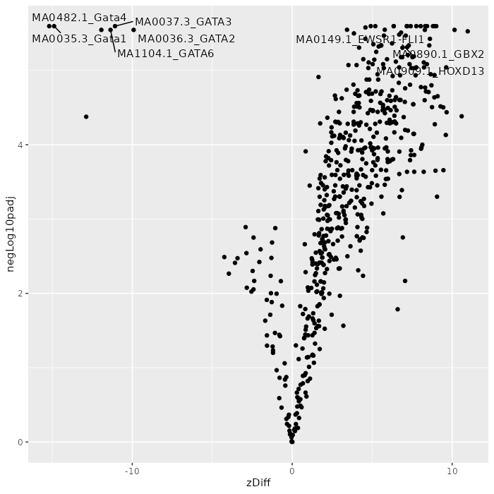

| Direction | Motif |
|---|---|
| More accessible in kidney | HOXD13 |
| More accessible in kidney | GBX2 |
| More accessible in liver (less accessible in kidney) | GATA4 |
| More accessible in liver (less accessible in kidney) | GATA1 |

GATA4 is a canonical hepatocyte regulator and GATA1 an erythroid regulator, both consistent with fetal liver; HOXD13 and GBX2 are developmental homeobox factors associated with urogenital and kidney patterning.

---

# Part 3 — Exploratory and differential analysis in R

## 1. Load the filtered dataset

```bash
cd /vol/COMPEPIWS/groups/atacseq1/tasks
source /vol/COMPEPIWS/conda/miniconda3/bin/activate /vol/COMPEPIWS/conda/miniconda3/envs/core
R
```

```r
dsa <- loadDsAcc("/vol/COMPEPIWS/groups/atacseq1/tasks/chraccr/ChrAccR_analysis/data/dsATAC_filtered")
dsa
```

Output:

```
2026-08-04 07:58:39     2.9  STATUS STARTED Loading region count data from HDF5
2026-08-04 07:58:39     2.9  STATUS     Region type: tiling
2026-08-04 07:58:39     3.0  STATUS     Region type: promoter
2026-08-04 07:58:39     3.0  STATUS     Region type: consensusPeaks
2026-08-04 07:58:39     3.0  STATUS COMPLETED Loading region count data from HDF5

DsATAC chromatin accessibility dataset
[contains disk-backed data]
contains:
 *  8  samples:  kidney_14_5_REP1, kidney_14_5_REP2, kidney_15_5_REP1, kidney_15_5_REP2, liver_14_5_REP1, ...
 *  fragment data for 8 samples [disk-backed]
 *  3 region types: tiling, promoter, consensusPeaks
 *  *  276356 regions of type tiling
 *  *  1216 regions of type promoter
 *  *  6256 regions of type consensusPeaks
```

### a. How many samples does it contain?

8 samples: kidney_14_5_REP1, kidney_14_5_REP2, kidney_15_5_REP1, kidney_15_5_REP2, liver_14_5_REP1, liver_14_5_REP2, liver_15_5_REP1, liver_15_5_REP2.

### b. How many fragments does each sample have?

```r
getFragmentNum(dsa)
```

Output:

```
kidney_14_5_REP1 kidney_14_5_REP2 kidney_15_5_REP1 kidney_15_5_REP2
         1526264          1765791          1731145          1946286
 liver_14_5_REP1  liver_14_5_REP2  liver_15_5_REP1  liver_15_5_REP2
          886943          2211394          1416303           856264
```

### c. Which region sets were summarized?

Three region types: tiling (276,356 regions), promoter (1,216) and consensusPeaks (6,256).

## 2. Heatmap of normalized counts for the 100 most variable peaks

```r
library(ChrAccR)
library(edgeR)
library(matrixStats)
library(pheatmap)

counts     <- ChrAccR::getCounts(dsa, type = "consensusPeaks")
dim(counts)

cpm_counts <- edgeR::cpm(counts)
logCpm     <- log2(cpm_counts + 1)

vars   <- matrixStats::rowVars(logCpm)
topIdx <- order(vars, decreasing = TRUE)[1:100]
topMat <- logCpm[topIdx, ]
dim(topMat)

sampleAnnot <- getSampleAnnot(dsa)[, c("tissue", "time", "replicate")]
sampleAnnot$time      <- as.character(sampleAnnot$time)
sampleAnnot$replicate <- as.character(sampleAnnot$replicate)

pheatmap(
  topMat,
  annotation_col = sampleAnnot,
  show_rownames  = FALSE,
  main     = "Top 100 Most Variable Peaks (log2 CPM)",
  filename = "/vol/COMPEPIWS/groups/atacseq1/tasks/chraccr/top100_variable_peaks_heatmap.png",
  width    = 8,
  height   = 10
)
```

Output:

```
[1] 6256    8   # full consensusPeaks matrix
[1]  100    8   # top-variable subset
```

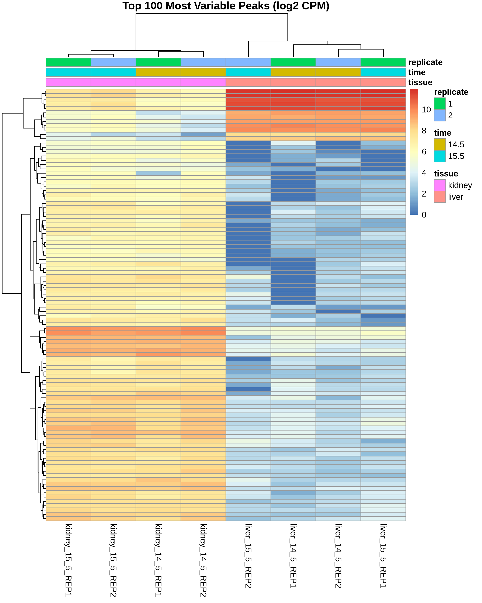

The 100 most variable consensus peaks resolve into two reciprocal blocks that cluster the samples strictly by tissue, with kidney and liver replicates on opposite sides of the dendrogram and no sub-clustering by developmental timepoint or replicate.

## 3. Export the peak and promoter count matrices

```r
library(GenomicRanges)

peakCounts     <- ChrAccR::getCounts(dsa, type = "consensusPeaks")
promoterCounts <- ChrAccR::getCounts(dsa, type = "promoter")
dim(peakCounts)
dim(promoterCounts)

peakRegions     <- getCoord(dsa, type = "consensusPeaks")
promoterRegions <- getCoord(dsa, type = "promoter")

peakTable <- data.frame(
  chrom = as.character(seqnames(peakRegions)),
  start = start(peakRegions),
  end   = end(peakRegions),
  peakCounts,
  check.names = FALSE)

promoterTable <- data.frame(
  chrom = as.character(seqnames(promoterRegions)),
  start = start(promoterRegions),
  end   = end(promoterRegions),
  promoterCounts,
  check.names = FALSE)

dim(peakTable)
dim(promoterTable)

write.table(peakTable,
  file = "/vol/COMPEPIWS/groups/atacseq1/tasks/chraccr/consensusPeaks_counts.tsv",
  sep = "\t", quote = FALSE, row.names = FALSE)

write.table(promoterTable,
  file = "/vol/COMPEPIWS/groups/atacseq1/tasks/chraccr/promoter_counts.tsv",
  sep = "\t", quote = FALSE, row.names = FALSE)
```

Output:

```
[1] 6256    8
[1] 1216    8
[1] 6256   11
[1] 1216   11

$ head -3 /vol/COMPEPIWS/groups/atacseq1/tasks/chraccr/consensusPeaks_counts.tsv
chrom	start	end	kidney_14_5_REP1	kidney_14_5_REP2	kidney_15_5_REP1	kidney_15_5_REP2	liver_14_5_REP1	liver_14_5_REP2	liver_15_5_REP1	liver_15_5_REP2
chr18	3166614	3166877	6	3	8	6	3	7	5	4
chr18	3248832	3249131	7	9	6	13	9	20	11	8
```

Two tab-separated count matrices were exported: `consensusPeaks_counts.tsv` (6,256 peaks x 8 samples) and `promoter_counts.tsv` (1,216 promoters x 8 samples), each with three leading coordinate columns.

## 4. chromVAR motif activities for the consensus peak set (JASPAR vertebrate)

```r
library(BSgenome)
library(BSgenome.Mmusculus.UCSC.mm10)

dsa <- getChromVarDev(dsa, type = "consensusPeaks", motifs = "jaspar_vert")
dsa
```

Output:

```
class: chromVARDeviations
dim: 579 8
metadata(0):
assays(2): deviations z
rownames(579): MA0004.1_Arnt MA0006.1_Ahr::Arnt ... MA1420.1_IRF5
  MA1421.1_TCF7L1
rowData names(3): name fractionMatches fractionBackgroundOverlap
colnames(8): kidney_14_5_REP1 kidney_14_5_REP2 ... liver_15_5_REP1
  liver_15_5_REP2
colData names(6): sampleId tissue ... bamFile .bamPath
```

chromVAR motif deviations were computed for 579 JASPAR vertebrate transcription-factor motifs across the 8 samples.

## 5. Motif variability — which are the 5 most variable motifs?

```r
# keep the chromVAR result separately and reload the accessibility dataset,
# because getChromVarDev() returns a chromVARDeviations object, not a DsATAC
chrvarDev <- dsa
dsa <- loadDsAcc("/vol/COMPEPIWS/groups/atacseq1/tasks/chraccr/ChrAccR_analysis/data/dsATAC_filtered")

class(chrvarDev)
class(dsa)

library(chromVAR)
variability <- computeVariability(chrvarDev)
head(variability[order(variability$variability, decreasing = TRUE), ], 5)

png("/vol/COMPEPIWS/groups/atacseq1/tasks/chraccr/motif_variability_plot.png", width = 1000, height = 500)
plotVariability(variability, n = 5, use_plotly = FALSE)
dev.off()
```

Output:

```
[1] "chromVARDeviations"
[1] "DsATAC"

                            name variability bootstrap_lower_bound
MA0482.1_Gata4             Gata4    9.175753              5.978392
MA0035.3_Gata1             Gata1    7.800222              4.837025
MA1104.1_GATA6             GATA6    7.257755              4.417712
MA0037.3_GATA3             GATA3    6.717928              4.071015
MA0140.2_GATA1::TAL1 GATA1::TAL1    6.465464              4.075264
                     bootstrap_upper_bound       p_value   p_value_adj
MA0482.1_Gata4                    9.428777 4.757173e-123 2.754403e-120
MA0035.3_Gata1                    8.308335  6.611351e-88  1.913986e-85
MA1104.1_GATA6                    7.789700  1.204712e-75  2.325095e-73
MA0037.3_GATA3                    7.238502  2.408983e-64  3.487003e-62
MA0140.2_GATA1::TAL1              6.829358  2.282215e-59  2.642805e-57
```


The 5 most variable motifs are Gata4, Gata1, GATA6, GATA3 and GATA1::TAL1. Variability drops off sharply after these, all lie well above their bootstrap lower bounds, and all belong to a single TF family, so one family dominates accessibility variance across the eight samples. GATA4 and GATA6 point to hepatocyte identity, while GATA1, GATA3 and GATA1::TAL1 point to the erythroid progenitor population of the fetal liver.

## 6. Heatmap of deviation Z-scores for the 20 most variable motifs

```r
library(chromVAR)
library(pheatmap)

top20       <- variability[order(variability$variability, decreasing = TRUE), ][1:20, ]
top20_names <- rownames(top20)

zscores <- deviationScores(chrvarDev)
dim(zscores)

zscores_top20 <- zscores[top20_names, ]
dim(zscores_top20)

sampleAnnot <- getSampleAnnot(dsa)[, c("tissue", "time", "replicate")]
sampleAnnot$time      <- as.character(sampleAnnot$time)
sampleAnnot$replicate <- as.character(sampleAnnot$replicate)

pheatmap(
  zscores_top20,
  annotation_col = sampleAnnot,
  labels_row = top20$name,
  main       = "Deviation Z-scores: Top 20 Most Variable Motifs",
  filename   = "/vol/COMPEPIWS/groups/atacseq1/tasks/chraccr/top20_motif_zscore_heatmap.png",
  width      = 8,
  height     = 10
)
```

Output:

```
[1] 579   8
[1]  20   8
```


The heatmap splits the samples into kidney and liver clusters and shows two reciprocal motif blocks: a HOX/POU-family block with positive Z-scores in kidney, and a GATA-family block with positive Z-scores in liver. Tissue-specific regulatory programmes are therefore the dominant source of motif variability, with no structure attributable to timepoint or replicate.

## 7. Differentially accessible peaks between kidney and liver

### a. Differential statistics per peak

```r
library(ChrAccR)

diffTab <- getDiffAcc(
  dsa,
  regionType    = "consensusPeaks",
  comparisonCol = "tissue",
  grp1Name      = "kidney",
  grp2Name      = "liver")

dim(diffTab)
head(diffTab)
```

Output:

```
[1] 6256   13
  log2BaseMean meanLog10FpkmGrp1_kidney meanLog10FpkmGrp2_liver
1     2.365953                 1.315763                1.528380
2     3.419277                 1.441532                1.859934
3     7.773107                 1.517899                2.801872
4     7.867118                 2.367077                2.326638
5    11.220022                 2.917175                3.576840
6     3.409884                 1.542748                1.687985
  meanVstCountGrp1_kidney meanVstCountGrp2_liver   baseMean log2FoldChange
1                4.817100               4.991119    5.15493     -0.6344846
2                4.962643               5.449800   10.69806     -1.3866805
3                5.596080               8.714708  218.74515     -4.4342741
4                8.105678               7.989325  233.47398      0.1131918
5                9.784143              11.930823 2385.41150     -2.1925434
6                5.124813               5.285835   10.62863     -0.4032822
      lfcSE        stat       pvalue         padj cRank cRank_rerank
1 0.6622183  -0.9581201 3.380022e-01 3.915818e-01  5400         5259
2 0.4774669  -2.9042445 3.681406e-03 6.429614e-03  3582         3190
3 0.3052041 -14.5288826 7.950677e-48 1.884070e-46   264          189
4 0.2053250   0.5512812 5.814409e-01 6.305836e-01  5990         5943
5 0.1841708 -11.9049428 1.115398e-32 1.409683e-31  1452         1021
6 0.5170046  -0.7800360 4.353697e-01 4.893411e-01  5566         5446
```

The sign convention was checked by comparing `meanVstCountGrp1_kidney` against `meanVstCountGrp2_liver` and cross-checking against the sign of `log2FoldChange`:

- kidney > liver → ratio > 1 → log2(ratio) > 0 → **positive = more accessible in kidney**
- liver > kidney → ratio < 1 → log2(ratio) < 0 → **negative = more accessible in liver**

### b. Classify each peak (padj < 0.01, |log2FC| > 3)

```r
diffTab$category <- "not differential"
diffTab$category[diffTab$padj < 0.01 & diffTab$log2FoldChange >  3] <- "more accessible in kidney"
diffTab$category[diffTab$padj < 0.01 & diffTab$log2FoldChange < -3] <- "more accessible in liver"

table(diffTab$category)
```

Output:

```
more accessible in kidney  more accessible in liver          not differential
                      109                       509                      5638
```

Liver has roughly five times as many differentially accessible peaks as kidney.

### c. Volcano plot

```r
library(ggplot2)

ggplot(diffTab, aes(x = log2FoldChange, y = -log10(padj), color = category)) +
  geom_point(alpha = 0.6, size = 1) +
  scale_color_manual(values = c(
    "more accessible in kidney" = "blue",
    "more accessible in liver"  = "red",
    "not differential"          = "grey70"
  )) +
  labs(
    title = "Differential Accessibility: Kidney vs. Liver",
    x     = "log2 Fold Change (kidney vs. liver)",
    y     = "-log10(adjusted p-value)",
    color = "Category"
  ) +
  theme_minimal()

ggsave("/vol/COMPEPIWS/groups/atacseq1/tasks/chraccr/volcano_diffAcc.png", width = 8, height = 6)
```


The liver-enriched arm (red, negative log2FC) is both denser and reaches substantially higher significance than the kidney-enriched arm (blue, positive log2FC), consistent with the 509 versus 109 counts from part b.

### d. Add genome coordinates to the differential table

```r
coords <- getCoord(dsa, type = "consensusPeaks")

diffTab$chrom <- as.character(seqnames(coords))
diffTab$start <- start(coords)
diffTab$end   <- end(coords)

head(diffTab[, c("chrom", "start", "end", "log2FoldChange", "padj", "category")])
```

Output:

```
  chrom   start     end log2FoldChange         padj                 category
1 chr18 3166614 3166877     -0.6344846 3.915818e-01         not differential
2 chr18 3248832 3249131     -1.3866805 6.429614e-03         not differential
3 chr18 3270288 3271129     -4.4342741 1.884070e-46 more accessible in liver
4 chr18 3280578 3282022      0.1131918 6.305836e-01         not differential
5 chr18 3336691 3338116     -2.1925434 1.409683e-31         not differential
6 chr18 3358928 3359253     -0.4032822 4.893411e-01         not differential
```

The chrom/start/end columns match the row order of the original consensusPeaks count matrix.

### e. Annotate each peak with the nearest gene TSS and the distance to it

```r
library(ChrAccRAnnotationMm10)
library(GenomicRanges)

tssGr <- ChrAccRAnnotationMm10::getGeneAnnotation(anno = "gencode_coding", type = "tssGr")

class(tssGr)
length(tssGr)
head(tssGr)
```

Output (excerpt):

```
[1] "GRanges"
[1] 21963

GRanges object with 6 ranges and 20 metadata columns:
      seqnames    ranges strand |   source     type     score     phase
  [1]     chr1   3671498      - |   HAVANA     gene        NA      <NA>
  [2]     chr1   4409241      - |   HAVANA     gene        NA      <NA>
  [3]     chr1   4497354      - |   HAVANA     gene        NA      <NA>
  [4]     chr1   4785739      - |   HAVANA     gene        NA      <NA>
  [5]     chr1   4807788      + |   HAVANA     gene        NA      <NA>
  [6]     chr1   4807892      + |   HAVANA     gene        NA      <NA>
                    gene_id      gene_type   gene_name       level
  [1]  ENSMUSG00000051951.5 protein_coding        Xkr4           2
  [2] ENSMUSG00000025900.12 protein_coding         Rp1           2
  [3] ENSMUSG00000025902.13 protein_coding       Sox17           2
  [4] ENSMUSG00000033845.13 protein_coding      Mrpl15           2
  [5] ENSMUSG00000025903.14 protein_coding      Lypla1           2
  [6]  ENSMUSG00000104217.1 protein_coding     Gm37988           2
  -------
  seqinfo: 66 sequences from mm10 genome
```

```r
peakGr <- GRanges(
  seqnames = diffTab$chrom,
  ranges   = IRanges(start = diffTab$start, end = diffTab$end))

nearest <- distanceToNearest(peakGr, tssGr)

class(nearest)
length(nearest)
head(as.data.frame(nearest))
```

Output:

```
[1] "SortedByQueryHits"
[1] 6256
  queryHits subjectHits distance
1         1       19579    43201
2         2       19580    88616
3         3       19580    66618
4         4       19580    55725
5         5       19580        0
6         6       19580    21179
```

```r
nearestDf <- as.data.frame(nearest)

diffTab$nearest_gene    <- tssGr$gene_name[nearestDf$subjectHits]
diffTab$distance_to_tss <- nearestDf$distance

head(diffTab[, c("chrom", "start", "end", "log2FoldChange", "padj",
                 "category", "nearest_gene", "distance_to_tss")])

range(diffTab$distance_to_tss)
```

Output:

```
  chrom   start     end log2FoldChange         padj                 category
1 chr18 3166614 3166877     -0.6344846 3.915818e-01         not differential
2 chr18 3248832 3249131     -1.3866805 6.429614e-03         not differential
3 chr18 3270288 3271129     -4.4342741 1.884070e-46 more accessible in liver
4 chr18 3280578 3282022      0.1131918 6.305836e-01         not differential
5 chr18 3336691 3338116     -2.1925434 1.409683e-31         not differential
6 chr18 3358928 3359253     -0.4032822 4.893411e-01         not differential
  nearest_gene distance_to_tss
1     Vmn1r238           43201
2         Crem           88616
3         Crem           66618
4         Crem           55725
5         Crem               0
6         Crem           21179
```

For each of the 6,256 consensus peaks the nearest protein-coding TSS (mm10, GENCODE) and the distance to it in base pairs were annotated using `distanceToNearest()`. Distances start at 0 (peaks directly overlapping a TSS) and extend well beyond 100 kb for isolated distal peaks.

### f. Export the annotated differential peak table

```r
write.table(
  diffTab,
  file = "/vol/COMPEPIWS/groups/atacseq1/tasks/chraccr/diffTab_consensuspeaks_annotated.tsv",
  sep = "\t", quote = FALSE, row.names = FALSE
)
```

Verified by reloading:

```r
d <- read.delim("/vol/COMPEPIWS/groups/atacseq1/tasks/chraccr/diffTab_consensuspeaks_annotated.tsv")
head(d[, c("chrom", "start", "end", "nearest_gene", "distance_to_tss")], 3)
class(d$start)
class(d$end)
```

Output:

```
  chrom   start     end nearest_gene distance_to_tss
1 chr18 3166614 3166877     Vmn1r238           43201
2 chr18 3248832 3249131         Crem           88616
3 chr18 3270288 3271129         Crem           66618
[1] "integer"
[1] "integer"
```

### g. Violin plot of distances to the nearest TSS per category (max 100 kb)

```r
library(ggplot2)

diffTab_filtered <- diffTab[diffTab$distance_to_tss <= 100000, ]

ggplot(diffTab_filtered, aes(x = category, y = distance_to_tss, fill = category)) +
  geom_violin() +
  labs(
    title = "Distance to Nearest TSS by Differential Category",
    x = "Category",
    y = "Distance to nearest TSS (bp)") +
  theme_minimal() +
  theme(legend.position = "none")

ggsave("/vol/COMPEPIWS/groups/atacseq1/tasks/chraccr/violin_tss_distance.png", width = 8, height = 6)
```


Non-differential and liver-specific peaks have their density mass close to zero distance, i.e. most sit at or near a TSS, whereas the kidney-specific distribution is visibly shifted toward larger distances, indicating a more distal placement.

### h. Are differential peaks further from genes than non-differential peaks?

```r
dist_kidney  <- diffTab$distance_to_tss[diffTab$category == "more accessible in kidney"]
dist_liver   <- diffTab$distance_to_tss[diffTab$category == "more accessible in liver"]
dist_notdiff <- diffTab$distance_to_tss[diffTab$category == "not differential"]

wilcox.test(dist_kidney, dist_notdiff, alternative = "greater")
wilcox.test(dist_liver,  dist_notdiff, alternative = "greater")
```

Output:

```
	Wilcoxon rank sum test with continuity correction
data:  dist_kidney and dist_notdiff
W = 414073, p-value = 2.32e-10
alternative hypothesis: true location shift is greater than 0


	Wilcoxon rank sum test with continuity correction
data:  dist_liver and dist_notdiff
W = 1314490, p-value = 0.9992
alternative hypothesis: true location shift is greater than 0
```

Kidney-specific peaks are significantly farther from the nearest TSS than non-differential peaks (p = 2.32e-10). Liver-specific peaks are not (p = 0.9992), so the distal shift applies to the kidney-specific set only, matching the violin plot.

### i. Export the differential peak sets as BED files

```r
bedKidney <- diffTab[diffTab$category == "more accessible in kidney", c("chrom", "start", "end")]
write.table(bedKidney,
  file = "/vol/COMPEPIWS/groups/atacseq1/tasks/chraccr/kidney_specific_peaks.bed",
  sep = "\t", quote = FALSE, row.names = FALSE, col.names = FALSE)

bedLiver <- diffTab[diffTab$category == "more accessible in liver", c("chrom", "start", "end")]
write.table(bedLiver,
  file = "/vol/COMPEPIWS/groups/atacseq1/tasks/chraccr/liver_specific_peaks.bed",
  sep = "\t", quote = FALSE, row.names = FALSE, col.names = FALSE)

nrow(bedKidney)
nrow(bedLiver)
```

Output:

```
[1] 109
[1] 509
```

## 8. Combine samples by tissue

### a. Aggregate dataset per tissue

```r
dsaTissue <- mergeSamples(dsa, mergeGroups = "tissue")
dsaTissue
getSamples(dsaTissue)
```

Output:

```
DsATAC chromatin accessibility dataset
[contains disk-backed data]
contains:
 *  2  samples:  kidney, liver
 *  fragment data for 2 samples [disk-backed]
 *  3 region types: tiling, promoter, consensusPeaks
 *  *  276356 regions of type tiling
 *  *  1216 regions of type promoter
 *  *  6256 regions of type consensusPeaks

[1] "kidney" "liver"
```

The 8 individual samples (4 kidney, 4 liver) were merged into 2 aggregate samples, one per tissue.

### b. 200 bp tiling windows added to the tissue dataset

```r
library(GenomeInfoDb)
library(GenomicRanges)

# restrict to chr18 and chr19 to match the reduced reference
seqLengths <- seqlengths(getCoord(dsa, type = "tiling"))
seqLengths <- seqLengths[!is.na(seqLengths)]
seqLengths_reduced <- seqLengths[c("chr18", "chr19")]
seqLengths_reduced

tiles200 <- tileGenome(seqLengths_reduced, tilewidth = 200, cut.last.tile.in.chrom = TRUE)
class(tiles200)
length(tiles200)
head(tiles200)

dsaTissue <- regionAggregation(dsaTissue, regGr = tiles200,
                               type = "tiling200bp", signal = "insertions")
dsaTissue
```

Output:

```
seqLengths_reduced:
   chr18    chr19
90702639 61431566

class(tiles200): "GRanges"
length(tiles200): 760672

GRanges object with 6 ranges and 0 metadata columns:
      seqnames    ranges strand
  [1]    chr18     1-200      *
  [2]    chr18   201-400      *
  [3]    chr18   401-600      *
  [4]    chr18   601-800      *
  [5]    chr18  801-1000      *
  [6]    chr18 1001-1200      *

2026-08-04 STATUS Aggregating counts for sample kidney (1 of 2) ...
2026-08-04 STATUS Aggregating counts for sample liver (2 of 2) ...
2026-08-04 INFO Aggregated signal counts across 760672 regions
2026-08-04 INFO   of which 699164 regions contained signal counts

DsATAC chromatin accessibility dataset
[contains disk-backed data]
contains:
 *  2  samples:  kidney, liver
 *  fragment data for 2 samples [disk-backed]
 *  4 region types: tiling, promoter, consensusPeaks, tiling200bp
 *  *  276356 regions of type tiling
 *  *  1216 regions of type promoter
 *  *  6256 regions of type consensusPeaks
 *  *  699164 regions of type tiling200bp
```

760,672 genome-wide 200 bp tiles were created for chr18 and chr19 and insertion-site signal was aggregated into them for the tissue-merged dataset. 699,164 of the tiles contained observed counts and were retained.

### c. Export count tracks for IGV

```r
dir.create("/vol/COMPEPIWS/groups/atacseq1/tasks/chraccr/igv_tracks", showWarnings = FALSE)

exportCountTracks(
  dsaTissue,
  type    = "tiling200bp",
  outDir  = "/vol/COMPEPIWS/groups/atacseq1/tasks/chraccr/igv_tracks",
  formats = "bed")

system("ls -la /vol/COMPEPIWS/groups/atacseq1/tasks/chraccr/igv_tracks")
```

Output:

```
total 62744
-rw-rw-r-- 1 divyashree_05 atacseq1 21692504 Aug  4 11:47 DsATAC_counts.igv
-rw-rw-r-- 1 divyashree_05 atacseq1 21381369 Aug  4 11:53 kidney_counts.bed
-rw-rw-r-- 1 divyashree_05 atacseq1 21159495 Aug  4 11:53 liver_counts.bed
```

## 9. Aggregate TF footprints from the tissue-combined dataset

```r
motifNames <- c("MA0482.1_Gata4", "MA0035.3_Gata1", "MA0890.1_GBX2", "MA0909.1_HOXD13")

fps <- getMotifFootprints(dsaTissue, motifNames,
                          samples = getSamples(dsaTissue),
                          motifDb = "jaspar_vert")
class(fps)
names(fps)
```

Output (excerpt):

```
2026-08-04 13:09:53  STATUS  STARTED Finding motif occurrences
2026-08-04 13:09:53    INFO      Using annotation from package: ChrAccRAnnotationMm10
2026-08-04 13:10:45  STATUS  COMPLETED Finding motif occurrences
2026-08-04 13:10:45  STATUS  STARTED Computing sample coverage
2026-08-04 13:11:13  STATUS  COMPLETED Computing sample coverage
2026-08-04 13:11:13  STATUS  STARTED Computing sample insertion k-mer frequencies
2026-08-04 13:13:15  STATUS  COMPLETED Computing sample insertion k-mer frequencies
2026-08-04 13:13:30  STATUS  COMPLETED Motif: MA0482.1_Gata4
2026-08-04 13:13:47  STATUS  COMPLETED Motif: MA0035.3_Gata1
2026-08-04 13:13:54  STATUS  COMPLETED Motif: MA0890.1_GBX2
2026-08-04 13:14:15  STATUS  COMPLETED Motif: MA0909.1_HOXD13

[1] "list"
[1] "MA0482.1_Gata4"  "MA0035.3_Gata1"  "MA0890.1_GBX2"   "MA0909.1_HOXD13"
```

```r
library(ggplot2)

for (m in names(fps)) {
  p <- fps[[m]]$plot
  fname <- paste0("/vol/COMPEPIWS/groups/atacseq1/tasks/chraccr/footprint_",
                  gsub("[:.]", "_", m), ".png")
  ggsave(fname, plot = p, width = 8, height = 6)
  cat("Saved:", fname, "\n")
}

system("ls -la /vol/COMPEPIWS/groups/atacseq1/tasks/chraccr/footprint_*.png")
```

A footprint plot shows Tn5 insertion frequency around all occurrences of a motif. The characteristic peak–dip–peak shape arises because insertion is elevated in the accessible flanks but blocked at the motif itself where a protein is bound, so the depth of the central dip reports TF occupancy and the height of the flanks reports local accessibility.

**footprint_MA0035_3_Gata1.png**


Sharp central protection at the motif with clearly higher flanking insertion signal in liver than kidney, indicating that GATA1 sites are both more accessible and occupied specifically in liver. GATA4 (`footprint_MA0482_1_Gata4.png`, not shown) gives the same pattern.

**footprint_MA0909_1_HOXD13.png**


A central footprint dip is present, but the kidney and liver traces overlap almost exactly across the whole window, so HOXD13 sites show no tissue-specific occupancy difference at the aggregate level despite the motif being scored as kidney-enriched in the global chromVAR comparison. GBX2 (`footprint_MA0890_1_GBX2.png`, not shown) behaves identically.

## 10. Explore the data in IGV

### a. Open IGV with the mm10 genome assembly


IGV initialised on the mm10 assembly, providing the coordinate framework for all subsequent track overlays.

### b. Load the tracks

Consensus peak set (BED), the aggregated kidney and liver count tracks from task 8c (autoscaled), and the differential peak sets from task 7i.


All tracks loaded together, so raw accessibility signal, the consensus peak calls and the tissue-specific differential calls can be inspected at the same locus. Autoscaling puts the kidney and liver signal tracks on a common y-axis so their heights are directly comparable.

### c. Save the IGV session


The session was saved so that the identical track configuration can be restored for the later integrative comparisons.

### d. Explore the regions around the most differential peaks

```r
diffTab <- read.delim("/vol/COMPEPIWS/groups/atacseq1/tasks/chraccr/diffTab_consensuspeaks_annotated.tsv")

topDiff <- diffTab[order(diffTab$cRank), ][1:10,
  c("chrom", "start", "end", "category", "nearest_gene", "distance_to_tss", "cRank")]
topDiff
```

Output:

```
     chrom    start      end                 category  nearest_gene distance_to_tss cRank
1939 chr18 56977496 56978466 more accessible in liver C330018D20Rik            2127     6
3561 chr19  4558210  4559294 more accessible in liver           Pcx           47737    12
4234 chr19 17323134 17324303 more accessible in liver         Gcnt1           32363    13
4923 chr19 34656103 34657204 more accessible in liver         Ifit1           15231    13
2514 chr18 68198872 68199748 more accessible in liver       Fam210a          100584    14
4792 chr19 31780792 31781788 more accessible in liver         Prkg1           15758    18
995  chr18 32556674 32557238 more accessible in liver          Gypc            2795    20
3583 chr19  4858756  4859672 more accessible in liver          Ctsf            3626    20
6181 chr19 59360408 59361162 more accessible in liver         Pdzd8           14627    22
6203 chr19 59905464 59906789 more accessible in liver     Rab11fip2           36864    23
```

| cRank | Nearest gene | Distance to TSS | Type |
|---|---|---|---|
| 6 | C330018D20Rik | 2,127 bp | Promoter-proximal |
| 12 | Pcx | 47,737 bp | Distal (intronic) |
| 13 | Gcnt1 | 32,363 bp | Distal |
| 13 | Ifit1 | 15,231 bp | Distal |
| 14 | Fam210a | 100,584 bp | Distal (nearest gene outside the local view) |
| 18 | Prkg1 | 15,758 bp | Distal |
| 20 | Gypc | 2,795 bp | Promoter-proximal |
| 20 | Ctsf | 3,626 bp | Promoter-proximal |
| 22 | Pdzd8 | 14,627 bp | Distal |
| 23 | Rab11fip2 | 36,864 bp | Distal |

7 of the top 10 (70%) most differential peaks are distal; only 3 (30%) are promoter-proximal.


**Ctsf (promoter-proximal, 3,626 bp):** the liver-specific peak Interval_3586 sits directly within the Ctsf gene body, close to its transcribed region, illustrating a differential peak located near a gene's promoter.


**Pcx (distal, 47,737 bp):** the liver-specific peak Interval_3564 sits deep inside the Pcx gene, far from its transcription start site, illustrating a differential peak that is distal to the promoter.

All 10 of the top-ranked differential peaks are more accessible in liver, and all were confirmed in IGV via the `liver_specific_peaks.bed` track. Promoter-proximal peaks such as Ctsf sit directly within the gene's transcript, whereas distal peaks vary in character: some fall within the body of an unrelated gene (Pcx, intronic and far from its own TSS), and others sit in regions where even the nearest annotated gene is too far away to appear in a local (~20 kb) IGV view (Fam210a).

Changes are therefore more prominent at distal peaks than at promoters, indicating that the kidney-versus-liver differential accessibility is driven predominantly by distal regulatory elements. This is consistent with the statistical result from task 7h, where kidney-specific peaks were significantly farther from the nearest TSS than non-differential peaks (Wilcoxon, p = 2.32e-10).
