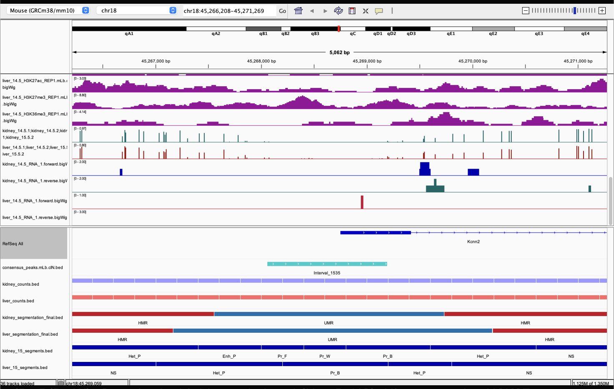
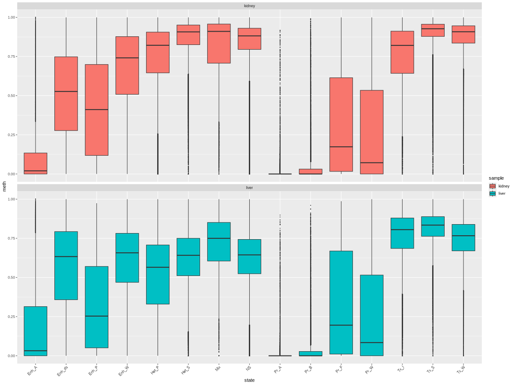
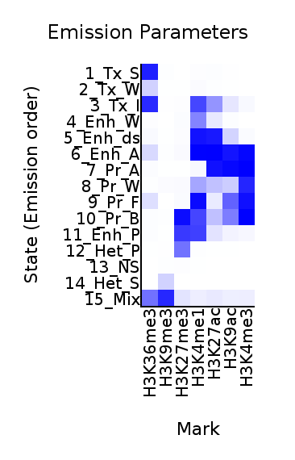
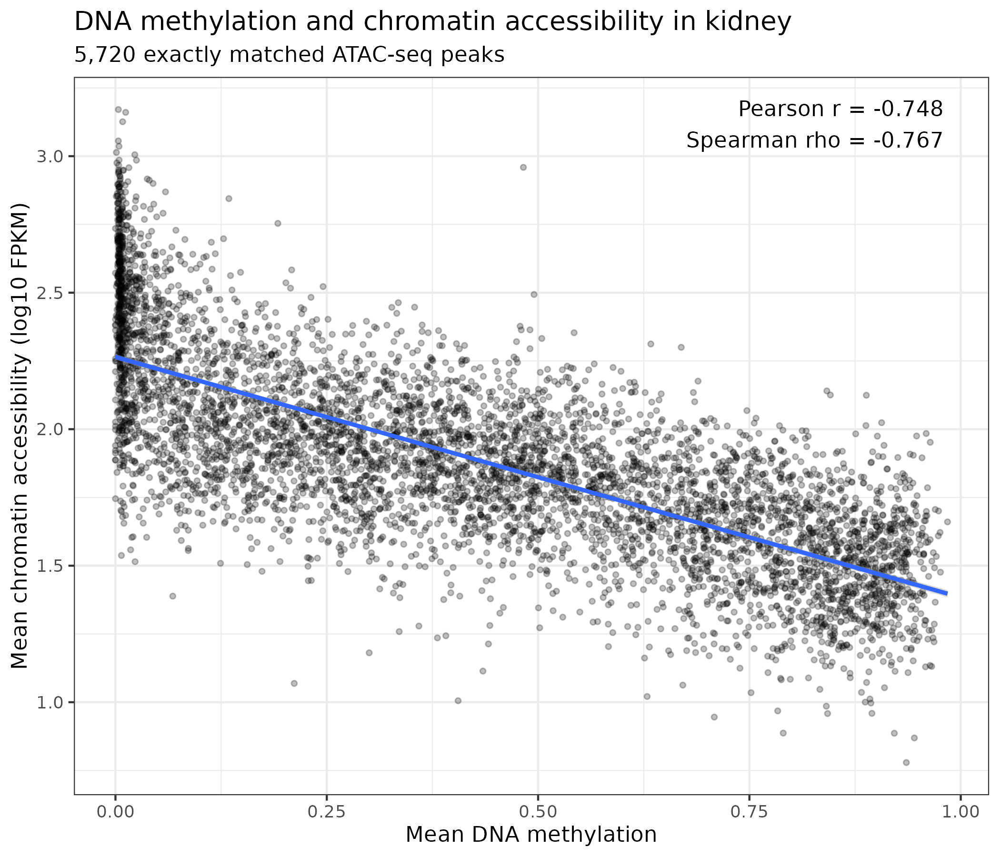
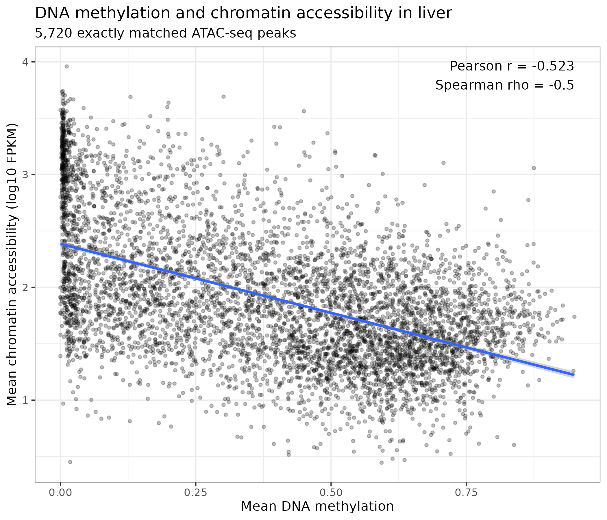
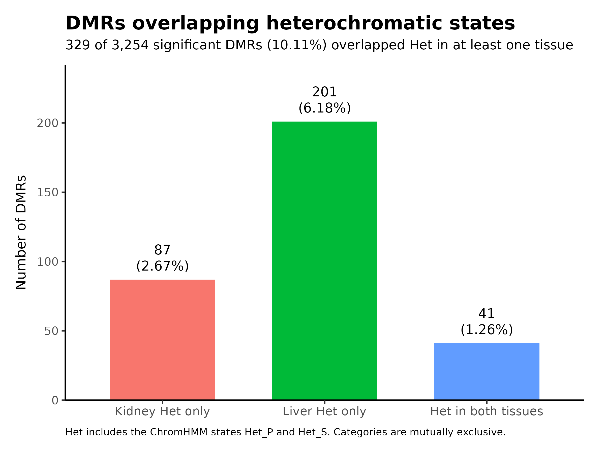
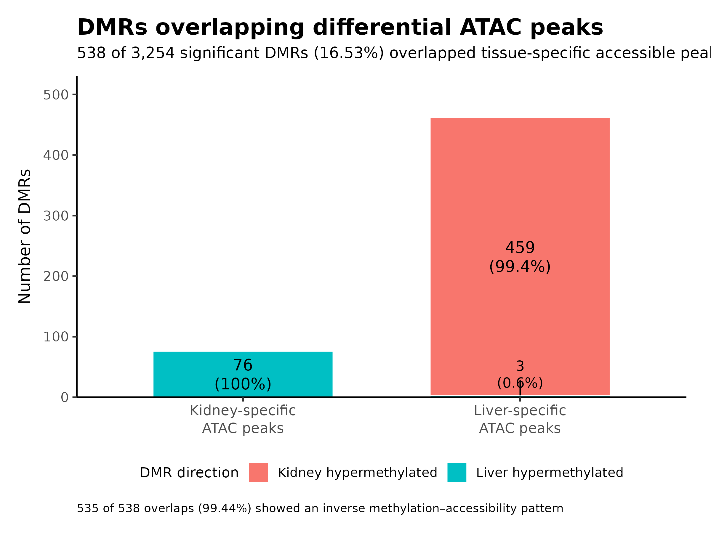
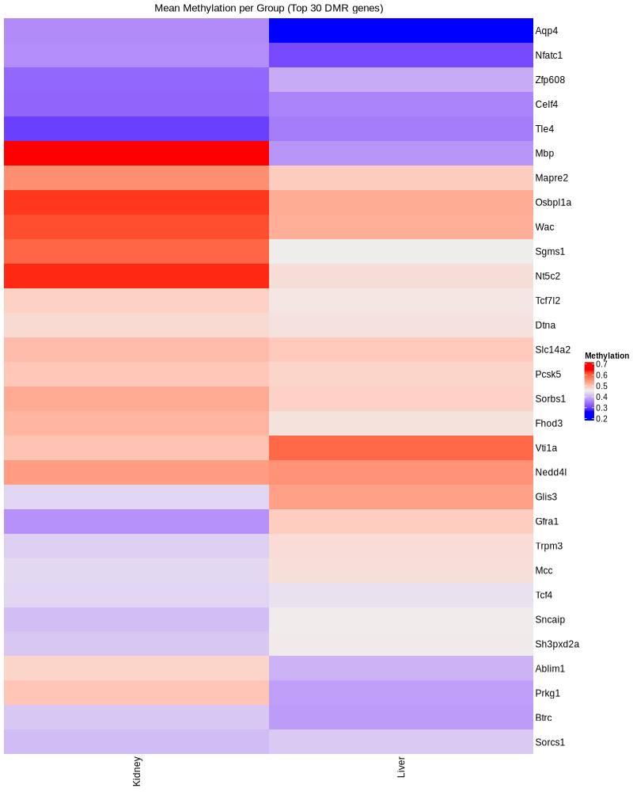
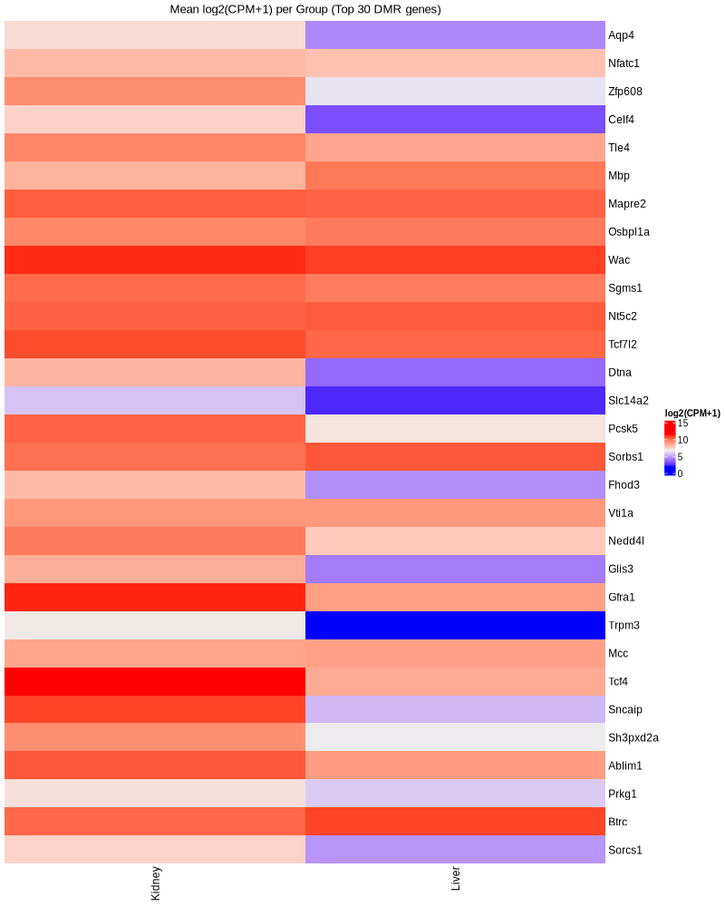

> **Part 2 of 2.** Covers preparation of the shared data for other groups, the summary questions, the integrative analysis (Tasks 1–5: IGV exploration, chromatin states and DNA methylation, methylation vs accessibility, DMRs vs chromatin states and accessibility, differential methylation vs gene expression) and the overall conclusions.
> Part 1 covers cluster setup, the nf-core/atacseq pipeline, the ChrAccR report and the differential analysis.

---

# Part 4 — Prepare data for downstream integrative analysis

Create the group folder structure:

```bash
mkdir -p /vol/COMPEPIWS/groups/shared/ATAC-seq/atacseq1/{peaks,signal,counts,differential}
```

Copy the consensus peak set:

```bash
cp \
/vol/COMPEPIWS/groups/atacseq1/tasks/nextflow_run/results/bwa/merged_library/macs2/narrow_peak/consensus/consensus_peaks.mLb.clN.bed \
/vol/COMPEPIWS/groups/shared/ATAC-seq/atacseq1/peaks/
```

Copy the peak and promoter count matrices:

```bash
cp \
/vol/COMPEPIWS/groups/atacseq1/tasks/chraccr/consensusPeaks_counts.tsv \
/vol/COMPEPIWS/groups/atacseq1/tasks/chraccr/promoter_counts.tsv \
/vol/COMPEPIWS/groups/shared/ATAC-seq/atacseq1/counts/
```

Copy the aggregated kidney and liver signal tracks:

```bash
cp \
/vol/COMPEPIWS/groups/atacseq1/tasks/chraccr/igv_tracks/kidney_counts.bed \
/vol/COMPEPIWS/groups/atacseq1/tasks/chraccr/igv_tracks/liver_counts.bed \
/vol/COMPEPIWS/groups/shared/ATAC-seq/atacseq1/signal/
```

Copy the differential accessibility results:

```bash
cp \
/vol/COMPEPIWS/groups/atacseq1/tasks/chraccr/diffTab_consensuspeaks_annotated.tsv \
/vol/COMPEPIWS/groups/atacseq1/tasks/chraccr/kidney_specific_peaks.bed \
/vol/COMPEPIWS/groups/atacseq1/tasks/chraccr/liver_specific_peaks.bed \
/vol/COMPEPIWS/groups/shared/ATAC-seq/atacseq1/differential/
```

## README file

```bash
nano /vol/COMPEPIWS/groups/shared/ATAC-seq/atacseq1/README.md
```

A README was created explaining the directory organisation, the content of each output file and how the files can be used by other groups:

- `peaks/` — consensus accessible chromatin peak set
- `counts/` — consensus peak and promoter count matrices
- `signal/` — aggregated kidney and liver accessibility tracks (200 bp tiles)
- `differential/` — annotated differential results and tissue-specific peak sets

## Permissions

```bash
# group ownership of the shared directory and all its contents
chgrp -R atacseq1 .

# directories: owner and atacseq1 group can modify; others may only enter and list.
# the setgid bit (2) makes new files inherit the atacseq1 group.
find . -type d -exec chmod 2775 {} \;

# files: owner and group read/write, everyone else read-only
find . -type f -exec chmod 664 {} \;
```

---

# Part 5 — Summary questions

### a. How were the peaks called?

Peaks were called from the aligned ATAC-seq reads using MACS2 within the nf-core/atacseq pipeline, in narrow-peak mode (`narrow_peak: true`) with an effective genome size of 145,658,490 bp corresponding to the reduced mm10 reference (chr18 and chr19).

MACS2 produced a `*_peaks.narrowPeak` file per sample containing the accessible chromatin regions, and a `*_summits.bed` file containing the position of strongest signal within each peak. Peaks from all samples were then merged into the consensus peak set used for the downstream ChrAccR analysis.

### b. What is the purpose of exploratory analysis? What are your conclusions about the data?

Exploratory analysis examines the overall structure of the dataset before any differential testing. It identifies the main sources of variation, shows whether biological replicates behave consistently, flags possible outliers, and reveals whether samples separate according to the biological variables of interest.

In this dataset tissue is the main source of variation. Kidney and liver samples form two clearly separated groups in the PCA and in the clustered heatmaps. The consensus peak region set gives the cleanest separation with PC1 explaining 79.69% of the variance, followed by promoters at 71.43%; tiling regions separate poorly (PC1 = 28.43%) because they are dominated by background.

The samples do not separate by developmental time, so the difference between E14.5 and E15.5 has a much weaker effect on chromatin accessibility than the difference between tissues.

### c. What is the purpose of normalization? Is normalized data used in the differential analysis?

Normalization corrects technical differences between samples, principally sequencing depth and total fragment number, so that observed accessibility differences are not simply a consequence of one sample having more reads than another.

Normalized or variance-stabilised counts are used for exploratory analyses such as PCA, clustering and heatmaps, because those methods assume comparable scales across samples.

They are not used directly for differential testing. The differential analysis takes the raw count matrix, and the statistical model estimates its own size factors internally. Raw counts are required because the model is built for count data and needs the untransformed values to estimate dispersion and hence biological variability between replicates.

### d. Observe the differential volcano plot; explain the directions

The x-axis is the log2 fold change for kidney relative to liver. Peaks with positive values lie on the right and are more accessible in kidney; peaks with negative values lie on the left and are more accessible in liver.

The y-axis is -log10(adjusted p-value), so points higher up have stronger statistical evidence for differential accessibility. Grey points are not differential, blue points are more accessible in kidney, red points more accessible in liver.

The plot shows more liver-accessible peaks than kidney-accessible peaks, and many of the liver-specific peaks reach very small adjusted p-values.

### e. Why are adjusted p-values used instead of raw p-values?

Because thousands of genomic regions are tested simultaneously. Under that many tests, some regions will reach small p-values by chance even when they are not truly differential. Multiple-testing adjustment controls the expected proportion of false positives among the calls, so adjusted p-values give reliable evidence for genuinely differentially accessible peaks.

### f. Why perform motif analyses?

To identify transcription factors that may drive the observed accessibility patterns. Transcription factors recognise short specific DNA motifs; if regions containing a given motif are systematically more accessible or more variable across samples, the corresponding factor is a candidate active regulator. Motif analysis therefore links differential accessibility to a plausible regulatory mechanism and to factors that distinguish kidney from liver.

---

# Part 6 — Integrative analysis

## Task 1 — Integrative data exploration in IGV

### 1. What are the methylation states of the promoters and the gene body in general (high, low)?


**Gm32139 locus** — the promoter region sits directly in an unmethylated region (UMR, blue) in both the kidney and liver segmentation, flanked on both sides by highly methylated regions (HMR, red). The ChromHMM states agree: the UMR is called Pr_W/Pr_B (weak/bivalent promoter) while the flanking HMR is NS/Het_P.


**Tmed7 and Eif1a locus** — both genes are strongly expressed. The segmentation shows a sharp UMR dip exactly at the TSS, matched by ChromHMM calling Pr_A (active promoter) at the same coordinate in both tissues. Immediately flanking that UMR the gene body sits in HMR, matched by Tx_S/Tx_I states.

Across both loci, promoters consistently sit in unmethylated regions (UMR, Pr_A/Pr_W) while gene bodies are highly methylated (HMR) despite active transcription. This is the gene-body methylation pattern: promoter hypomethylation permits transcription initiation, whereas gene-body methylation correlates with, rather than represses, elongation.

### 2. Which MethylSeekR states overlap which ChromHMM states?

| MethylSeekR state | ChromHMM state(s) it overlaps | Where seen |
|---|---|---|
| UMR (unmethylated) | Pr_A, Pr_W, Pr_B (active/weak/bivalent promoter) | Gm32139 TSS; Eif1a TSS in both tissues |
| HMR (highly methylated) | Tx_S, Tx_I (strong/initiating transcription) | Gene bodies of Tmed7 and Eif1a, both actively transcribed |
| HMR (highly methylated) | NS, Het_P (quiescent/heterochromatin) | Intergenic flanking regions at the Gm32139 locus |
| PMD (partially methylated domain) | NS (quiescent) | Right edge of the Gm32139 view |

### 3. Do accessibility peaks overlap specific chromatin states?


At the Eif1a TSS the peak Interval_1582 sits exactly on Pr_A in both kidney and liver.


At the Gm32139 promoter the peak Interval_1539 sits on Pr_W/Pr_B.


At BC031181 the peak Interval_2781 sits directly on Enh_A/Pr_A states in both tissues, coinciding with UMR methylation.

All three coordinates show UMR in the WGBS track, i.e. low methylation together with an active promoter or enhancer state. Chromatin accessibility peaks therefore specifically mark promoters and enhancers, and this holds at each individual locus examined.

### 4. Unexpressed genes: methylation states of their promoters and bodies, and enriched histone marks



**Kcnn2** is not expressed in either kidney or liver. Its promoter is unmethylated (Pr_B/Pr_W), its gene body highly methylated (Het_P, NS). H3K27ac (active) is flat, while H3K27me3 (repressive) is clearly enriched. This is the signature of a bivalent/poised promoter: accessible and unmethylated, but held inactive by Polycomb-deposited H3K27me3.

### 5. Associations between DNA methylation, chromatin accessibility, histone marks and gene expression

| Region type | DNA methylation | Accessibility (ATAC) | H3K27ac | H3K27me3 | H3K36me3 | Expression |
|---|---|---|---|---|---|---|
| Active promoter (Eif1a, BC031181) | Low (UMR) | Peak present | High | Low | — | High |
| Active gene body (Eif1a, Tmed7) | High (HMR) | Absent | — | — | High | High |
| Active enhancer (near Eif1a/BC031181) | Low, LMR-like | Peak present | Present | — | — | Drives nearby gene |
| Bivalent/poised promoter (Kcnn2) | Low (UMR) | Peak present | Flat/absent | **Enriched** | — | None |
| Silent gene body / intergenic | High (HMR/PMD) | Absent | Flat | Variable | Flat | None |

The relationship between methylation and expression depends on the region type: negative at promoters (low methylation permits expression) but positive at gene bodies (high methylation accompanies active transcription). Accessibility and H3K27ac track with expression at promoters and enhancers only. H3K36me3 marks active elongation specifically over gene bodies.

### 6. Example of a gene regulated by DNA methylation and chromatin accessibility


**Epb41l4a**

- **DEG:** the entire Epb41l4a locus falls within a differentially expressed region; RNA-seq confirms kidney-biased expression, most clearly at the gene's TSS.
- **DMR:** the strongest DMR in the region (score 0.704) sits directly on the UMR at the TSS, coinciding with the expression peak.
- **Chromatin state:** at the same TSS position, kidney shows an active enhancer state (Enh_A) while liver shows a weaker bivalent promoter state (Pr_B).
- **Differential accessibility:** a kidney-specific differential ATAC peak was also identified further upstream, within the gene body.

The four layers agree at a single locus: lower methylation, an active chromatin state and a tissue-specific accessible peak in kidney coincide with kidney-biased expression.

---

## Task 2 — Chromatin states and DNA methylation

### a. Average DNA methylation per chromatin state

Average DNA methylation was computed per ChromHMM state for one kidney and one liver sample (E15.5). Each tissue's WGBS methylation bedGraph was intersected with its matching 15-state ChromHMM segmentation using `GenomicRanges`, and methylation values were averaged within each state.

```r
library(GenomicRanges)
library(dplyr)
library(ggplot2)

kidney_states <- read.table("/vol/COMPEPIWS/groups/shared/ChIP-seq/chipseq1/segmentation/kidney_15_dense.bed",
                            skip = 1, sep = "\t")[, 1:4]
liver_states  <- read.table("/vol/COMPEPIWS/groups/shared/ChIP-seq/chipseq1/segmentation/liver_15_dense.bed",
                            skip = 1, sep = "\t")[, 1:4]
colnames(kidney_states) <- c("chr", "start", "end", "state")
colnames(liver_states)  <- c("chr", "start", "end", "state")

kidney_meth <- read.table("/vol/COMPEPIWS/groups/shared/WGBS/wgbs1/signal/rnbeads_kidney.bedGraph",
                          sep = "\t", skip = 1)
colnames(kidney_meth) <- c("chr", "start", "end", "meth")
liver_meth <- read.table("/vol/COMPEPIWS/groups/shared/WGBS/wgbs1/signal/rnbeads_liver.bedGraph",
                         sep = "\t", skip = 1)
colnames(liver_meth) <- c("chr", "start", "end", "meth")

# BED starts are 0-based, so +1 on import
kidney_states_gr <- GRanges(kidney_states$chr, IRanges(kidney_states$start + 1, kidney_states$end),
                            state = kidney_states$state)
liver_states_gr  <- GRanges(liver_states$chr,  IRanges(liver_states$start + 1, liver_states$end),
                            state = liver_states$state)
kidney_meth_gr   <- GRanges(kidney_meth$chr, IRanges(kidney_meth$start + 1, kidney_meth$end),
                            meth = kidney_meth$meth)
liver_meth_gr    <- GRanges(liver_meth$chr,  IRanges(liver_meth$start + 1, liver_meth$end),
                            meth = liver_meth$meth)

hits_kidney <- findOverlaps(kidney_meth_gr, kidney_states_gr)
kidney_df <- data.frame(meth   = kidney_meth_gr$meth[queryHits(hits_kidney)],
                        state  = kidney_states_gr$state[subjectHits(hits_kidney)],
                        sample = "kidney")

hits_liver <- findOverlaps(liver_meth_gr, liver_states_gr)
liver_df <- data.frame(meth   = liver_meth_gr$meth[queryHits(hits_liver)],
                       state  = liver_states_gr$state[subjectHits(hits_liver)],
                       sample = "liver")

combined_df <- rbind(kidney_df, liver_df)

avg_meth <- combined_df %>% group_by(sample, state) %>% summarise(mean_meth = mean(meth, na.rm = TRUE))
print(avg_meth, n = 40)
write.csv(avg_meth, "avg_methylation_per_state.csv", row.names = FALSE)
```

### b. Boxplot of methylation per state, split by tissue

```r
png("methylation_by_state_boxplot.png", width = 1200, height = 900)
ggplot(combined_df, aes(x = state, y = meth, fill = sample)) +
  geom_boxplot(outlier.size = 0.3) +
  facet_wrap(~sample, ncol = 1) +
  theme(axis.text.x = element_text(angle = 45, hjust = 1))
dev.off()
```



Median methylation is near zero at the active promoter states (Pr_A 0.009–0.014, Pr_B 0.038–0.051), intermediate at Pr_W, Pr_F and the enhancer states, and high (>0.6) at Tx_S, Tx_W, Het_P, Het_S, NS and Mix in both tissues. The kidney panel is visibly shifted upward relative to liver in the heterochromatic and quiescent states, which is the same pattern quantified numerically in part d. The active-promoter states also have the tightest distributions, whereas the enhancer and transcription states show wide spread, reflecting the mixture of regulatory contexts each of those states covers.

### c. Which histone marks define the least- and most-methylated states?

```bash
cat /vol/COMPEPIWS/groups/shared/ChIP-seq/chipseq1/segmentation/models_merged/15_states/reordered_labeled/emissions_15.txt
```

Output (7 emission columns: H3K36me3, H3K9me3, H3K27me3, H3K4me1, H3K27ac, H3K9ac, H3K4me3):

```
State	H3K36me3	H3K9me3	H3K27me3	H3K4me1	H3K27ac	H3K9ac	H3K4me3
1_Tx_S	0.8797	0.0049	0.0009	0.0079	0.0099	0.0037	0.0002
2_Tx_W	0.1796	0.0022	0.0016	0.0165	0.0050	0.0021	0.0000
3_Tx_I	0.8391	0.0036	0.0077	0.7274	0.4186	0.0982	0.0251
4_Enh_W	0.0069	0.0010	0.0137	0.4851	0.0880	0.0101	0.0004
5_Enh_ds	0.0221	0.0020	0.0116	0.9295	0.9058	0.1711	0.0183
6_Enh_A	0.1504	0.0067	0.0187	0.9948	0.9969	0.9228	0.9790
7_Pr_A	0.0136	0.0022	0.0017	0.0246	0.9378	0.9738	1.0000
8_Pr_W	0.0064	0.0162	0.0190	0.3512	0.2433	0.1986	0.8561
9_Pr_F	0.1280	0.0004	0.0167	0.9615	0.0808	0.6147	0.9414
10_Pr_B	0.0107	0.0052	0.9547	0.7295	0.2466	0.5095	0.9972
11_Enh_P	0.0089	0.0018	0.7768	0.7512	0.1095	0.0464	0.0307
12_Het_P	0.0015	0.0047	0.5548	0.0056	0.0012	0.0029	0.0007
13_NS	0.0005	0.0052	0.0070	0.0022	0.0006	0.0005	0.0000
14_Het_S	0.0007	0.1792	0.0003	0.0001	0.0004	0.0002	0.0001
15_Mix	0.5577	0.8495	0.1082	0.0662	0.0865	0.0647	0.0663
```

| State | H3K4me3 | H3K9ac | H3K27ac | H3K36me3 | Interpretation |
|---|---|---|---|---|---|
| Pr_A (least methylated) | 1.00 | 0.97 | 0.94 | 0.01 | Active promoter marks |
| Tx_S (most methylated) | 0.00 | 0.00 | 0.01 | 0.88 | Active transcriptional elongation mark |

Pr_A is defined by strong enrichment of H3K4me3, H3K9ac and H3K27ac; active promoters are kept unmethylated so that they remain accessible to the transcription machinery. Tx_S is defined almost exclusively by H3K36me3, the mark deposited co-transcriptionally during elongation, and its high methylation reflects gene-body methylation rather than repression.



The ChromHMM emission heatmap shows the same thing directly: row `7_Pr_A` has dark, saturated cells for H3K27ac, H3K9ac and H3K4me3, while row `1_Tx_S` has a single dark cell for H3K36me3 with all other marks near-white.

### d. Differences between kidney and liver per state

| State | Kidney | Liver | Difference (K - L) |
|---|---|---|---|
| Enh_A | 0.125 | 0.194 | -0.07 |
| Enh_P | 0.422 | 0.322 | +0.10 |
| Enh_W | 0.670 | 0.603 | +0.07 |
| Enh_ds | 0.510 | 0.569 | -0.06 |
| Het_P | 0.728 | 0.505 | +0.22 |
| Het_S | 0.862 | 0.622 | +0.24 |
| Mix | 0.788 | 0.703 | +0.09 |
| NS | 0.838 | 0.621 | +0.22 |
| Pr_A | 0.009 | 0.014 | ~0.00 |
| Pr_B | 0.051 | 0.038 | +0.01 |
| Pr_F | 0.317 | 0.330 | -0.01 |
| Pr_W | 0.270 | 0.254 | +0.02 |
| Tx_I | 0.747 | 0.746 | ~0.00 |
| Tx_S | 0.898 | 0.812 | +0.09 |
| Tx_W | 0.865 | 0.738 | +0.13 |

Kidney is consistently more methylated than liver in the heterochromatic and quiescent states, with the largest gaps at Het_S (+0.24), Het_P (+0.22) and NS (+0.22). The promoter states are nearly identical between tissues (all differences under 0.02). The two tissues therefore differ mainly in their inactive and repressed chromatin, not at active promoters, which are constitutively unmethylated in both.

---

## Task 3 — DNA methylation and chromatin accessibility

The aim was to relate DNA methylation to chromatin accessibility within ATAC-seq peaks, separately for kidney and liver.

### Input data

ATAC-seq: the annotated differential accessibility table produced in Part 3.

```
/vol/COMPEPIWS/groups/shared/ATAC-seq/atacseq1/differential/diffTab_consensuspeaks_annotated.tsv
```

6,256 consensus peaks with coordinates, per-tissue mean accessibility (`meanLog10FpkmGrp1_kidney`, `meanLog10FpkmGrp2_liver`), differential statistics, nearest gene and TSS distance.

WGBS: the mystery-region differential methylation table from group `wgbs2`.

```
/vol/COMPEPIWS/groups/shared/WGBS/wgbs2/differential/diff_meth_mystery_regions_annotated.csv
```

The WGBS group confirmed that `mean.mean.g1` = kidney and `mean.mean.g2` = liver methylation, given as proportions from 0 (unmethylated) to 1 (fully methylated), with both developmental timepoints summarised within each tissue group.

### Coordinate conversion and matching

The ATAC coordinates came from a `GRanges` object and are 1-based; the WGBS table uses BED-style 0-based starts, so 1 bp was added to the WGBS start before matching. Only exactly matching intervals were used, so that methylation and accessibility refer to the identical genomic region.

```r
library(GenomicRanges)
library(ggplot2)

atac <- read.delim("/vol/COMPEPIWS/groups/shared/ATAC-seq/atacseq1/differential/diffTab_consensuspeaks_annotated.tsv",
                   header = TRUE, stringsAsFactors = FALSE, check.names = FALSE)
wgbs <- read.csv("/vol/COMPEPIWS/groups/shared/WGBS/wgbs2/differential/diff_meth_mystery_regions_annotated.csv",
                 header = TRUE, stringsAsFactors = FALSE, check.names = FALSE)

atac_gr <- GRanges(atac$chrom,       IRanges(atac$start,      atac$end))
wgbs_gr <- GRanges(wgbs$Chromosome,  IRanges(wgbs$Start + 1,  wgbs$End))

hits_equal <- findOverlaps(wgbs_gr, atac_gr, type = "equal")
equal_df   <- as.data.frame(hits_equal)
```

Input dimensions were 6,256 x 19 (ATAC) and 6,094 x 18 (WGBS). 5,720 WGBS regions matched an ATAC peak exactly, one-to-one, with no duplicated regions on either side.

### Combined table

```r
combined <- data.frame(
  chrom                  = atac$chrom[equal_df$subjectHits],
  start                  = atac$start[equal_df$subjectHits],
  end                    = atac$end[equal_df$subjectHits],
  nearest_gene           = atac$nearest_gene[equal_df$subjectHits],
  distance_to_tss        = atac$distance_to_tss[equal_df$subjectHits],
  kidney_accessibility   = atac$meanLog10FpkmGrp1_kidney[equal_df$subjectHits],
  liver_accessibility    = atac$meanLog10FpkmGrp2_liver[equal_df$subjectHits],
  accessibility_log2FC   = atac$log2FoldChange[equal_df$subjectHits],
  accessibility_padj     = atac$padj[equal_df$subjectHits],
  accessibility_category = atac$category[equal_df$subjectHits],
  kidney_methylation     = wgbs$mean.mean.g1[equal_df$queryHits],
  liver_methylation      = wgbs$mean.mean.g2[equal_df$queryHits],
  methylation_difference = wgbs$mean.mean.diff[equal_df$queryHits],
  methylation_fdr        = wgbs$comb.p.adj.fdr[equal_df$queryHits],
  num_CpG_sites          = wgbs$num.sites[equal_df$queryHits],
  stringsAsFactors = FALSE
)

write.table(combined, "ATAC_WGBS_exact_matched_peaks.tsv",
            sep = "\t", quote = FALSE, row.names = FALSE)
```

The combined table has 5,720 rows x 15 columns, with no missing values in the four measurement columns.

### Correlation

Pearson was computed to test for a linear relationship and Spearman as a rank-based check that does not assume linearity.

```r
pearson_kidney  <- cor(combined$kidney_methylation, combined$kidney_accessibility,
                       method = "pearson",  use = "complete.obs")
spearman_kidney <- cor(combined$kidney_methylation, combined$kidney_accessibility,
                       method = "spearman", use = "complete.obs")
pearson_liver   <- cor(combined$liver_methylation,  combined$liver_accessibility,
                       method = "pearson",  use = "complete.obs")
spearman_liver  <- cor(combined$liver_methylation,  combined$liver_accessibility,
                       method = "spearman", use = "complete.obs")

correlation_results <- data.frame(
  tissue   = c("Kidney", "Liver"),
  Pearson  = c(pearson_kidney,  pearson_liver),
  Spearman = c(spearman_kidney, spearman_liver)
)
correlation_results

write.table(correlation_results, "ATAC_WGBS_correlation_results.tsv",
            sep = "\t", quote = FALSE, row.names = FALSE)
```

| Tissue | Pearson r | Spearman rho |
|---|---:|---:|
| Kidney | -0.748 | -0.767 |
| Liver | -0.523 | -0.500 |

### Kidney scatterplot

```r
kidney_plot <- ggplot(combined, aes(x = kidney_methylation, y = kidney_accessibility)) +
  geom_point(alpha = 0.25, size = 1) +
  geom_smooth(method = "lm", formula = y ~ x, se = TRUE) +
  annotate("text", x = Inf, y = Inf, hjust = 1.1, vjust = 1.3,
           label = paste0("Pearson r = ", round(pearson_kidney, 3),
                          "\nSpearman rho = ", round(spearman_kidney, 3))) +
  labs(title    = "DNA methylation and chromatin accessibility in kidney",
       subtitle = paste0(nrow(combined), " exactly matched ATAC-seq peaks"),
       x = "Mean DNA methylation",
       y = "Mean chromatin accessibility (log10 FPKM)") +
  theme_bw()

ggsave("kidney_methylation_vs_accessibility.png", kidney_plot,
       width = 7, height = 6, dpi = 300)
```



Each point is one ATAC-seq peak. The trend is clearly downward: peaks with low methylation have higher accessibility, highly methylated peaks lower accessibility. Pearson r = -0.748 and Spearman rho = -0.767 indicate a strong negative association in kidney.

### Liver scatterplot

```r
liver_plot <- ggplot(combined, aes(x = liver_methylation, y = liver_accessibility)) +
  geom_point(alpha = 0.25, size = 1) +
  geom_smooth(method = "lm", formula = y ~ x, se = TRUE) +
  annotate("text", x = Inf, y = Inf, hjust = 1.1, vjust = 1.3,
           label = paste0("Pearson r = ", round(pearson_liver, 3),
                          "\nSpearman rho = ", round(spearman_liver, 3))) +
  labs(title    = "DNA methylation and chromatin accessibility in liver",
       subtitle = paste0(nrow(combined), " exactly matched ATAC-seq peaks"),
       x = "Mean DNA methylation",
       y = "Mean chromatin accessibility (log10 FPKM)") +
  theme_bw()

ggsave("liver_methylation_vs_accessibility.png", liver_plot,
       width = 7, height = 6, dpi = 300)
```



The liver plot shows the same downward trend but with visibly wider dispersion (Pearson r = -0.523, Spearman rho = -0.500), so methylation explains less of the accessibility variation in liver than in kidney.

### Interpretation

Both tissues show an inverse relationship between DNA methylation and chromatin accessibility, stronger in kidney (r = -0.748) than in liver (r = -0.523). A large fraction of peaks sits close to zero methylation yet still spans a broad range of accessibility values, so low methylation is permissive for open chromatin but is not sufficient to determine how open a region is; transcription-factor binding, nucleosome positioning and histone modification state all contribute. The analysis establishes association, not causation.

---

## Task 4 — DMRs, chromatin states and accessibility

This task asked how many kidney–liver DMRs overlap heterochromatic ChromHMM states, and how many overlap differentially accessible ATAC-seq peaks.

### Input files

```
/vol/COMPEPIWS/groups/shared/WGBS/wgbs1/differential/diff_meth_table.csv
/vol/COMPEPIWS/groups/shared/ChIP-seq/chipseq1/segmentation/kidney_15_segments.bed
/vol/COMPEPIWS/groups/shared/ChIP-seq/chipseq1/segmentation/liver_15_segments.bed
/vol/COMPEPIWS/groups/shared/ATAC-seq/atacseq1/differential/kidney_specific_peaks.bed
/vol/COMPEPIWS/groups/shared/ATAC-seq/atacseq1/differential/liver_specific_peaks.bed
```

For the WGBS table g1 = kidney and g2 = liver, so `mean.mean.diff` = kidney methylation minus liver methylation: positive means kidney hypermethylated, negative means liver hypermethylated. The segmentation contains two heterochromatin subclasses, Het_P and Het_S, both treated as the general `Het` category. The ATAC files contain the 109 kidney-specific and 509 liver-specific peaks exported in Part 3.

Of the 6,145 tested WGBS regions, 3,254 were significant at FDR < 0.05. WGBS coordinates were treated as 1-based; the ChromHMM and ATAC BED files use 0-based starts, so 1 was added on import. Ordinary genomic overlap (at least one shared base) was used rather than exact matching, because DMRs, ATAC peaks and ChromHMM segments have independent boundaries.

### Result 1 — DMRs overlapping heterochromatin

| Category | Number of DMRs | % of all DMRs |
|---|---:|---:|
| Kidney Het | 128 | 3.93% |
| Liver Het | 242 | 7.44% |
| Het in either tissue | **329** | **10.11%** |
| Het in both tissues | 41 | 1.26% |

329 of 3,254 significant DMRs (10.11%) overlap a heterochromatic state in at least one tissue. The kidney and liver counts cannot be added directly because 41 DMRs overlap Het in both tissues. For plotting, mutually exclusive categories were used: kidney Het only (87), liver Het only (201), Het in both (41), summing to the 329 unique DMRs.



Most kidney–liver methylation differences therefore occur outside heterochromatin, and liver Het accounts for more than twice as many DMRs as kidney Het. This count alone does not establish enrichment or depletion; that would require comparison against the total genomic coverage of the Het states.

### Result 2 — DMRs overlapping differential ATAC peaks

| Category | Number of DMRs | % of all DMRs |
|---|---:|---:|
| Kidney-specific ATAC peaks | 76 | 2.34% |
| Liver-specific ATAC peaks | 462 | 14.20% |
| Any differential ATAC peak | **538** | **16.53%** |
| Both ATAC peak sets | 0 | 0% |

538 of 3,254 significant DMRs (16.53%) overlap a differentially accessible peak, so a substantial subset of the methylation differences occur at regions that also change in accessibility.

### Direction of methylation versus accessibility

| ATAC peak type | Kidney hypermethylated | Liver hypermethylated |
|---|---:|---:|
| Kidney-specific accessible peaks | 0 | 76 |
| Liver-specific accessible peaks | 459 | 3 |

All 76 kidney-specific overlaps are liver-hypermethylated, and 459 of 462 liver-specific overlaps are kidney-hypermethylated: 535 of 538 overlaps (99.44%) show an inverse relationship, i.e. the tissue with the more accessible peak is the tissue with the lower methylation.



The stacked bars are almost single-coloured within each peak type, which is the visual form of the 99.44% figure. The association is very consistent but still does not demonstrate that methylation causes the accessibility difference.

### R script

```r
suppressPackageStartupMessages({
  library(GenomicRanges)
  library(ggplot2)
})

dmr_file             <- "/vol/COMPEPIWS/groups/shared/WGBS/wgbs1/differential/diff_meth_table.csv"
kidney_chromhmm_file <- "/vol/COMPEPIWS/groups/shared/ChIP-seq/chipseq1/segmentation/kidney_15_segments.bed"
liver_chromhmm_file  <- "/vol/COMPEPIWS/groups/shared/ChIP-seq/chipseq1/segmentation/liver_15_segments.bed"
kidney_atac_file     <- "/vol/COMPEPIWS/groups/shared/ATAC-seq/atacseq1/differential/kidney_specific_peaks.bed"
liver_atac_file      <- "/vol/COMPEPIWS/groups/shared/ATAC-seq/atacseq1/differential/liver_specific_peaks.bed"

dmr <- read.csv(dmr_file, stringsAsFactors = FALSE)
dmr <- dmr[!is.na(dmr$comb.p.adj.fdr) & dmr$comb.p.adj.fdr < 0.05, ]
dmr_gr <- GRanges(dmr$Chromosome, IRanges(dmr$Start, dmr$End))

# BED starts are 0-based; convert to 1-based on import
read_bed_gr <- function(file, state_column = FALSE) {
  x  <- read.delim(file, header = FALSE, stringsAsFactors = FALSE)
  gr <- GRanges(x[[1]], IRanges(x[[2]] + 1, x[[3]]))
  if (state_column) gr$state <- x[[4]]
  gr
}

kidney_chromhmm <- read_bed_gr(kidney_chromhmm_file, state_column = TRUE)
liver_chromhmm  <- read_bed_gr(liver_chromhmm_file,  state_column = TRUE)

kidney_het <- kidney_chromhmm[kidney_chromhmm$state %in% c("Het_P", "Het_S")]
liver_het  <- liver_chromhmm[liver_chromhmm$state   %in% c("Het_P", "Het_S")]

kidney_atac <- read_bed_gr(kidney_atac_file)
liver_atac  <- read_bed_gr(liver_atac_file)

kidney_het_overlap  <- countOverlaps(dmr_gr, kidney_het)  > 0
liver_het_overlap   <- countOverlaps(dmr_gr, liver_het)   > 0
kidney_atac_overlap <- countOverlaps(dmr_gr, kidney_atac) > 0
liver_atac_overlap  <- countOverlaps(dmr_gr, liver_atac)  > 0

any_het_overlap  <- kidney_het_overlap | liver_het_overlap
both_het_overlap <- kidney_het_overlap & liver_het_overlap
any_atac_overlap <- kidney_atac_overlap | liver_atac_overlap

dmr$DMR_direction <- ifelse(dmr$mean.mean.diff > 0,
                            "Kidney hypermethylated", "Liver hypermethylated")
dmr$overlap_kidney_Het  <- kidney_het_overlap
dmr$overlap_liver_Het   <- liver_het_overlap
dmr$overlap_kidney_ATAC <- kidney_atac_overlap
dmr$overlap_liver_ATAC  <- liver_atac_overlap

total_dmrs <- nrow(dmr)

summary_table <- data.frame(
  category = c("Total significant DMRs",
               "DMRs overlapping kidney Het",
               "DMRs overlapping liver Het",
               "DMRs overlapping Het in either tissue",
               "DMRs overlapping Het in both tissues",
               "DMRs overlapping kidney-specific ATAC peaks",
               "DMRs overlapping liver-specific ATAC peaks",
               "DMRs overlapping differential ATAC peaks"),
  count = c(total_dmrs,
            sum(kidney_het_overlap),  sum(liver_het_overlap),
            sum(any_het_overlap),     sum(both_het_overlap),
            sum(kidney_atac_overlap), sum(liver_atac_overlap),
            sum(any_atac_overlap))
)
summary_table$percentage <- round(100 * summary_table$count / total_dmrs, 2)

write.table(summary_table, "task4_overlap_summary.tsv",
            sep = "\t", quote = FALSE, row.names = FALSE)
write.csv(dmr, "task4_DMR_overlap_details.csv", row.names = FALSE)

# Plot 1: Het overlap, mutually exclusive categories
het_data <- data.frame(
  category = c("Kidney Het only", "Liver Het only", "Het in both tissues"),
  count    = c(sum(kidney_het_overlap & !liver_het_overlap),
               sum(liver_het_overlap  & !kidney_het_overlap),
               sum(both_het_overlap))
)
het_data$percentage <- 100 * het_data$count / total_dmrs
het_data$label <- paste0(het_data$count, "\n(", sprintf("%.2f", het_data$percentage), "%)")

plot_het <- ggplot(het_data, aes(category, count, fill = category)) +
  geom_col(width = 0.65, show.legend = FALSE) +
  geom_text(aes(label = label), vjust = -0.4, size = 4.5) +
  scale_y_continuous(expand = expansion(mult = c(0, 0.18))) +
  labs(title    = "DMRs overlapping heterochromatic states",
       subtitle = paste0(sum(any_het_overlap), " of ", total_dmrs, " significant DMRs (",
                         round(100 * sum(any_het_overlap) / total_dmrs, 2),
                         "%) overlapped Het in at least one tissue"),
       x = NULL, y = "Number of DMRs",
       caption = "Het includes the ChromHMM states Het_P and Het_S. Categories are mutually exclusive.") +
  theme_classic(base_size = 14) +
  theme(plot.title = element_text(face = "bold"), plot.caption = element_text(hjust = 0))

# Plot 2: differential ATAC overlap, split by methylation direction
atac_data <- data.frame(
  ATAC_peak_type = c("Kidney-specific", "Kidney-specific", "Liver-specific", "Liver-specific"),
  DMR_direction  = c("Kidney hypermethylated", "Liver hypermethylated",
                     "Kidney hypermethylated", "Liver hypermethylated"),
  count = c(sum(kidney_atac_overlap & dmr$mean.mean.diff > 0),
            sum(kidney_atac_overlap & dmr$mean.mean.diff < 0),
            sum(liver_atac_overlap  & dmr$mean.mean.diff > 0),
            sum(liver_atac_overlap  & dmr$mean.mean.diff < 0))
)
atac_data$ATAC_peak_type <- factor(atac_data$ATAC_peak_type,
                                   levels = c("Kidney-specific", "Liver-specific"))
atac_data$DMR_direction  <- factor(atac_data$DMR_direction,
                                   levels = c("Kidney hypermethylated", "Liver hypermethylated"))
atac_data$percentage <- ave(atac_data$count, atac_data$ATAC_peak_type,
                            FUN = function(x) 100 * x / sum(x))
atac_data$label <- ifelse(atac_data$count > 0,
                          paste0(atac_data$count, "\n(", sprintf("%.1f", atac_data$percentage), "%)"),
                          "")

inverse_count <- sum(kidney_atac_overlap & dmr$mean.mean.diff < 0) +
                 sum(liver_atac_overlap  & dmr$mean.mean.diff > 0)

plot_atac <- ggplot(atac_data, aes(ATAC_peak_type, count, fill = DMR_direction)) +
  geom_col(width = 0.65, color = "white") +
  geom_text(aes(label = label), position = position_stack(vjust = 0.5), size = 4.5) +
  scale_fill_manual(values = c("Kidney hypermethylated" = "#F8766D",
                               "Liver hypermethylated"  = "#00BFC4")) +
  scale_x_discrete(labels = c("Kidney-specific" = "Kidney-specific\nATAC peaks",
                              "Liver-specific"  = "Liver-specific\nATAC peaks")) +
  labs(title    = "DMRs overlapping differential ATAC peaks",
       subtitle = paste0(sum(any_atac_overlap), " of ", total_dmrs, " significant DMRs (",
                         round(100 * sum(any_atac_overlap) / total_dmrs, 2),
                         "%) overlapped\ntissue-specific accessible peaks"),
       x = NULL, y = "Number of DMRs", fill = "DMR direction",
       caption = paste0(inverse_count, " of ", sum(any_atac_overlap), " overlaps (",
                        round(100 * inverse_count / sum(any_atac_overlap), 2),
                        "%) showed an inverse methylation-accessibility pattern")) +
  theme_classic(base_size = 14) +
  theme(plot.title = element_text(face = "bold"), legend.position = "bottom",
        plot.caption = element_text(hjust = 0))

ggsave("task4_plot1_DMR_Het_overlap.png",  plot_het,  width = 8, height = 6, dpi = 300, bg = "white")
ggsave("task4_plot2_DMR_ATAC_overlap.png", plot_atac, width = 9, height = 6, dpi = 300, bg = "white")

print(summary_table)
```

---

## Task 5 — Differential methylation and gene expression

### a. Annotate each DMR to the closest gene

```bash
which bedtools
head -5 /vol/COMPEPIWS/pipelines/references/mm10_reduced_chr18_chr19_genes.bed
```

Output:

```
/vol/COMPEPIWS/conda/miniconda3/envs/core/bin/bedtools
chr18	3122491	3123412	NM_001167539	0	-	3122491	3123412	0	921,	0,
chr18	3266353	3281747	NM_001110855	0	-	3267984	3281727	0	1776,157,60,	0,7068,15334,
```

```bash
cd "/vol/COMPEPIWS/groups/atacseq1/tasks/integrative/task5_Differential expression"
sort -k1,1 -k2,2n /vol/COMPEPIWS/pipelines/references/mm10_reduced_chr18_chr19_genes.bed > genes_sorted.bed
sort -k1,1 -k2,2n diff_meth_table_wgbs.bed > dmr_sorted.bed
bedtools closest -a dmr_sorted.bed -b genes_sorted.bed -d > dmr_closest_gene.bed

head -5 dmr_closest_gene.bed
wc -l dmr_closest_gene.bed
```

Output:

```
chr18	3039424	3040223	0.00452247274457616	chr18	3122491	3123412	NM_001167539	0	-	3122491	3123412	0	1	921,	0,	82269
chr18	3040887	3041151	0.00452240072478466	chr18	3122491	3123412	NM_001167539	0	-	3122491	3123412	0	1	921,	0,	81341
chr18	3115558	3116159	0.037885558079405	chr18	3122491	3123412	NM_001167539	0	-	3122491	3123412	0	1	921,	0,	6333
chr18	3117492	3119082	0.00928531782388788	chr18	3122491	3123412	NM_001167539	0	-	3122491	3123412	0	1	921,	0,	3410
chr18	3166613	3166877	0.00184719860278927	chr18	3122491	3123412	NM_001167539	0	-	3122491	3123412	0	1	921,	0,	43202
9921 dmr_closest_gene.bed
```

Every DMR was matched to its nearest gene, with the final column giving the distance in bp (0 means overlapping). The output has 9,921 rows against 6,145 DMRs because some DMRs are equidistant from more than one transcript and are therefore reported more than once.

### b. How many DMRs per gene?

```bash
awk '{print $8}' dmr_closest_gene.bed | sort | uniq -c | sort -rn > gene_dmr_counts.txt
head -20 gene_dmr_counts.txt
wc -l gene_dmr_counts.txt
```

Output:

```
     59 NM_175751
     44 NM_144792
     44 NM_133195
     44 NM_001174074
     44 NM_001146294
     44 NM_001146293
     44 NM_001146292
     40 NM_013685
     37 NM_001168525
     35 NM_201354
     35 NM_009333
     35 NM_001142923
     35 NM_001142922
     35 NM_001142921
     35 NM_001142920
     35 NM_001142919
     35 NM_001142918
     35 NM_001083967
     32 NM_001033445
     31 NM_207651
1681 gene_dmr_counts.txt
```

```bash
awk '{print $1"_"$2"_"$3}' dmr_closest_gene.bed | sort -u | wc -l   # 6145 unique DMRs
awk '$1>1'  gene_dmr_counts.txt | wc -l                             # 1297 genes with >1 DMR
awk '$1==1' gene_dmr_counts.txt | wc -l                             #  384 genes with exactly 1
```

Most transcripts associated with a tested region have more than one (1,297 of 1,681), with the extreme case NM_175751 linked to 59 separate regions. Since tested regions (6,145) far outnumber unique transcripts (1,681), and those transcripts collapse to 1,045 genes once mapped through transcript_to_gene.tsv and joined with the expression table, differential methylation clusters around particular genes rather than being distributed one region per gene.

### c. Heatmaps of mean methylation per group and mean CPM of the closest genes

```r
library(GenomicRanges)
library(dplyr)
library(ComplexHeatmap)

dmr <- read.table("dmr_closest_gene.bed", sep = "\t")
colnames(dmr) <- c("chr","start","end","score","g_chr","g_start","g_end","transcript_id",
                   "x1","strand","x2","x3","x4","x5","x6","distance")
dmr <- dmr[, c("chr","start","end","score","transcript_id","distance")]

map <- read.table("transcript_to_gene.tsv", sep = "\t")
colnames(map) <- c("transcript_id","gene")
dmr <- merge(dmr, map, by = "transcript_id")

kidney_meth <- read.table("/vol/COMPEPIWS/groups/shared/WGBS/wgbs1/signal/rnbeads_kidney.bedGraph",
                          sep = "\t", skip = 1)
colnames(kidney_meth) <- c("chr","start","end","meth")
liver_meth <- read.table("/vol/COMPEPIWS/groups/shared/WGBS/wgbs1/signal/rnbeads_liver.bedGraph",
                         sep = "\t", skip = 1)
colnames(liver_meth) <- c("chr","start","end","meth")

dmr_gr    <- GRanges(dmr$chr, IRanges(dmr$start + 1, dmr$end))
kidney_gr <- GRanges(kidney_meth$chr, IRanges(kidney_meth$start + 1, kidney_meth$end),
                     meth = kidney_meth$meth)
liver_gr  <- GRanges(liver_meth$chr,  IRanges(liver_meth$start + 1, liver_meth$end),
                     meth = liver_meth$meth)

hk <- findOverlaps(dmr_gr, kidney_gr)
hl <- findOverlaps(dmr_gr, liver_gr)

dmr$kidney_meth <- NA
dmr$liver_meth  <- NA
dmr$kidney_meth[unique(queryHits(hk))] <- sapply(unique(queryHits(hk)),
  function(i) mean(kidney_gr$meth[subjectHits(hk)[queryHits(hk) == i]]))
dmr$liver_meth[unique(queryHits(hl))]  <- sapply(unique(queryHits(hl)),
  function(i) mean(liver_gr$meth[subjectHits(hl)[queryHits(hl) == i]]))

cpm <- read.csv("/vol/COMPEPIWS/groups/shared/RNA-seq/rnaseq1/DEGs/CPM_expression.csv")
cpm$kidney_cpm <- rowMeans(cpm[, c("kidney_14_5_RNA_1","kidney_14_5_RNA_2",
                                   "kidney_15_5_RNA_1","kidney_15_5_RNA_2")])
cpm$liver_cpm  <- rowMeans(cpm[, c("liver_14_5_RNA_1","liver_14_5_RNA_2",
                                   "liver_15_5_RNA_1","liver_15_5_RNA_2")])
cpm_small <- cpm[, c("gene_ID","kidney_cpm","liver_cpm")]
colnames(cpm_small) <- c("gene","kidney_cpm","liver_cpm")

gene_summary <- dmr %>%
  group_by(gene) %>%
  summarise(mean_kidney_meth = mean(kidney_meth, na.rm = TRUE),
            mean_liver_meth  = mean(liver_meth,  na.rm = TRUE),
            n_dmrs = n())
gene_summary <- merge(gene_summary, cpm_small, by = "gene")
write.csv(gene_summary, "gene_summary.csv", row.names = FALSE)

top_genes   <- gene_summary %>% arrange(desc(n_dmrs)) %>% head(30)
meth_matrix <- as.matrix(top_genes[, c("mean_kidney_meth","mean_liver_meth")])
rownames(meth_matrix) <- top_genes$gene
colnames(meth_matrix) <- c("Kidney","Liver")

# order rows once by the methylation clustering, then reuse for the CPM panel
gene_order <- rownames(meth_matrix)[hclust(dist(meth_matrix))$order]
meth_matrix_ordered <- meth_matrix[gene_order, ]

cpm_matrix <- as.matrix(log2(top_genes[, c("kidney_cpm","liver_cpm")] + 1))
rownames(cpm_matrix) <- top_genes$gene
colnames(cpm_matrix) <- c("Kidney","Liver")
cpm_matrix_ordered <- cpm_matrix[gene_order, ]

png("heatmap_methylation.png", width = 800, height = 1000)
Heatmap(meth_matrix_ordered, name = "Methylation",
        cluster_columns = FALSE, cluster_rows = FALSE,
        column_title = "Mean Methylation per Group (Top 30 DMR genes)")
dev.off()

png("heatmap_cpm.png", width = 800, height = 1000)
Heatmap(cpm_matrix_ordered, name = "log2(CPM+1)",
        cluster_columns = FALSE, cluster_rows = FALSE,
        column_title = "Mean log2(CPM+1) per Group (Top 30 DMR genes)")
dev.off()
```

`log2(CPM + 1)` was used rather than `log2(CPM)` because CPM is exactly 0 for unexpressed genes and `log2(0)` is undefined.



Across the 30 genes carrying the most DMRs, mean methylation is broadly comparable between kidney and liver for most rows, with a small number of strongly tissue-split genes driving the row ordering — Mbp is the clearest case, bright red in kidney (high methylation) and light blue in liver (low methylation).



The log2(CPM+1) panel, plotted in the same row order, does not mirror the methylation panel: Mbp is mid-orange in both tissues, i.e. comparably expressed, despite its large methylation difference. Gene-body-averaged methylation is therefore a poor predictor of expression level for these genes.

### d. Correlation between methylation and expression

```r
cor.test(gene_summary$mean_kidney_meth, gene_summary$kidney_cpm, method = "spearman")
cor.test(gene_summary$mean_liver_meth,  gene_summary$liver_cpm,  method = "spearman")
```

Output:

```
	Spearman's rank correlation rho

data:  gene_summary$mean_kidney_meth and gene_summary$kidney_cpm
S = 2.09e+08, p-value = 0.001376
alternative hypothesis: true rho is not equal to 0
sample estimates:
        rho
-0.09885249

Warning message:
In cor.test.default(...) : Cannot compute exact p-value with ties

	Spearman's rank correlation rho

data:  gene_summary$mean_liver_meth and gene_summary$liver_cpm
S = 212932971, p-value = 0.000107
alternative hypothesis: true rho is not equal to 0
sample estimates:
       rho
-0.1195557
```

| Tissue | Spearman rho | p-value |
|---|---|---|
| Kidney | -0.099 | 0.0014 |
| Liver | -0.120 | 0.0001 |

Both tissues show a weak but statistically significant negative correlation between DNA methylation and gene expression: higher methylation goes with lower expression. The correlation is weak because methylation was averaged across the whole gene, which mixes promoter methylation (negatively associated with expression) with gene-body methylation (positively associated with expression, as shown in Task 2). Separating promoter from gene-body CpGs would be expected to strengthen the promoter correlation considerably.

---

# Overall conclusions

1. **Tissue dominates over developmental time.** Kidney and liver separate cleanly in every exploratory view, with PC1 explaining 79.69% of variance on the consensus peak set, whereas E14.5 and E15.5 samples intermix within each tissue.
2. **Liver is the more accessible tissue in this comparison.** Using padj < 0.01 and |log2FC| > 3, 509 consensus peaks are more accessible in liver against 109 in kidney, and the liver arm of the volcano plot reaches far higher significance.
3. **Differential accessibility is distal.** 7 of the 10 top-ranked differential peaks are distal, and kidney-specific peaks are significantly farther from the nearest TSS than non-differential peaks (Wilcoxon, p = 2.32e-10). Promoter regions show almost no differential signal (7 kidney versus 2 liver).
4. **Motif variability is driven by one TF family.** The five most variable motifs are all GATA-family (Gata4, Gata1, GATA6, GATA3, GATA1::TAL1), split between hepatocyte identity (GATA4/GATA6) and the erythroid progenitor compartment of the fetal liver (GATA1, GATA1::TAL1). Kidney-enriched motifs are the developmental homeobox factors HOXD13 and GBX2, though their footprints show no tissue-specific occupancy difference.
5. **Methylation and accessibility are inversely related.** Across 5,720 exactly matched peaks, r = -0.748 in kidney and -0.523 in liver, and 99.44% of DMR–differential-peak overlaps show the tissue with higher accessibility having lower methylation.
6. **The methylation–expression relationship is region-dependent.** Promoters are unmethylated regardless of tissue (Pr_A: 0.009 kidney, 0.014 liver), gene bodies are highly methylated even when actively transcribed (Tx_S: 0.898/0.812), and the two tissues differ mainly in their heterochromatic and quiescent states (Het_S +0.24 in kidney). Averaging methylation over whole genes therefore yields only a weak negative correlation with expression (rho = -0.10 to -0.12).
