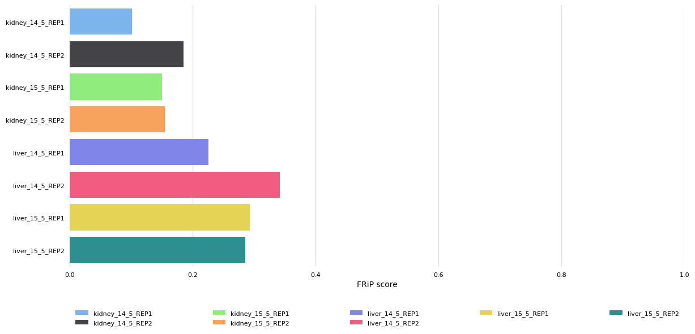
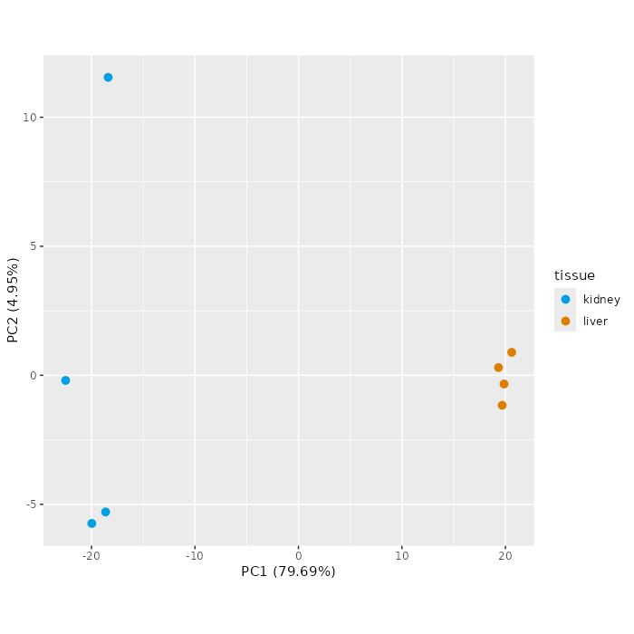
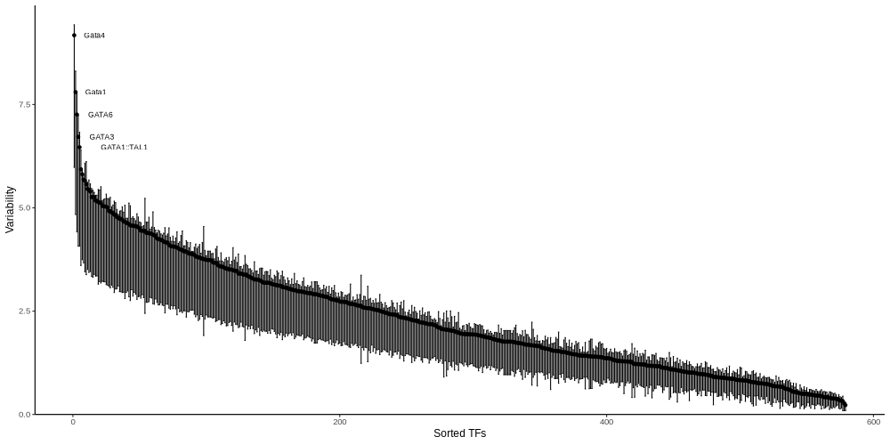
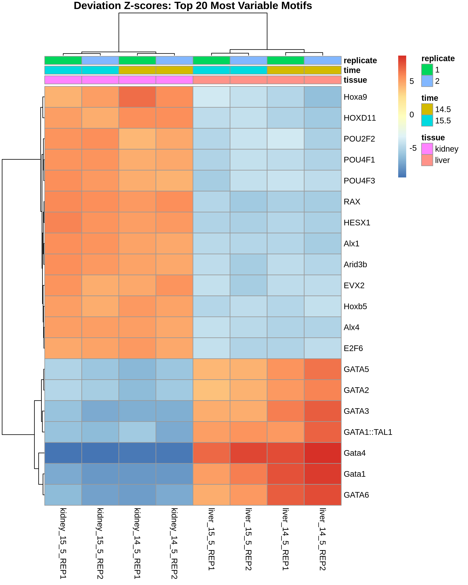
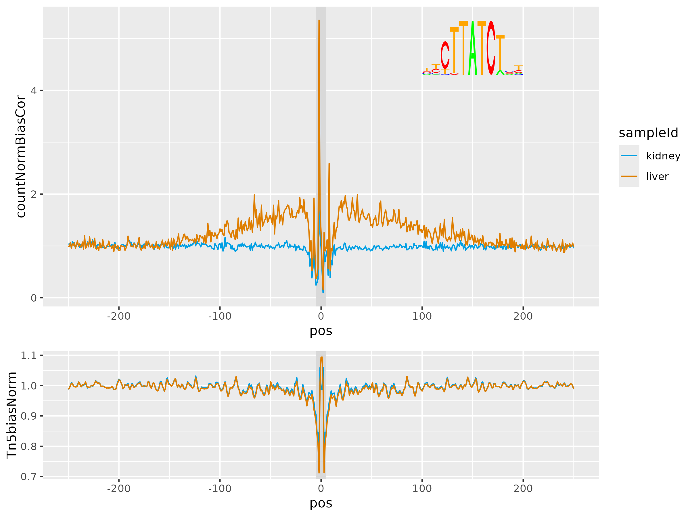
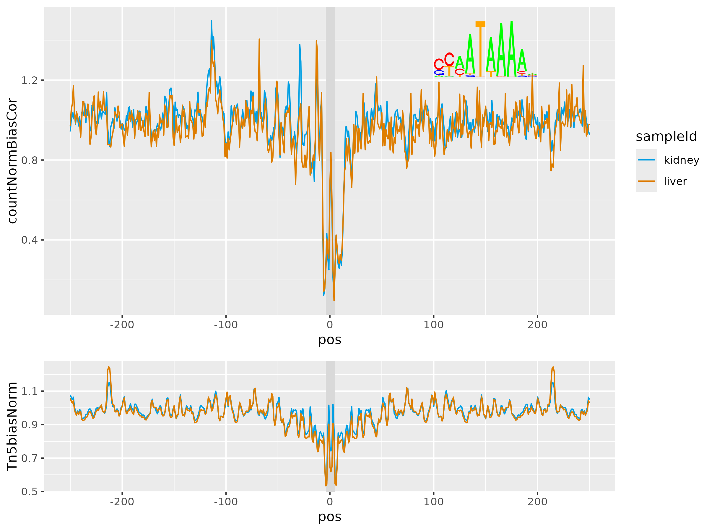
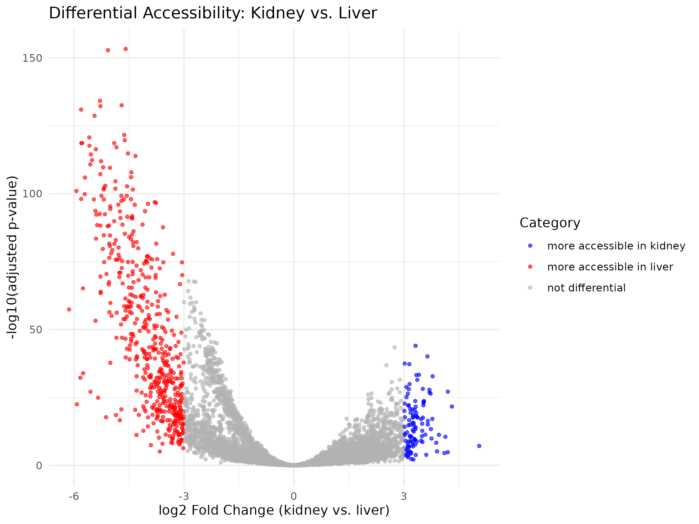
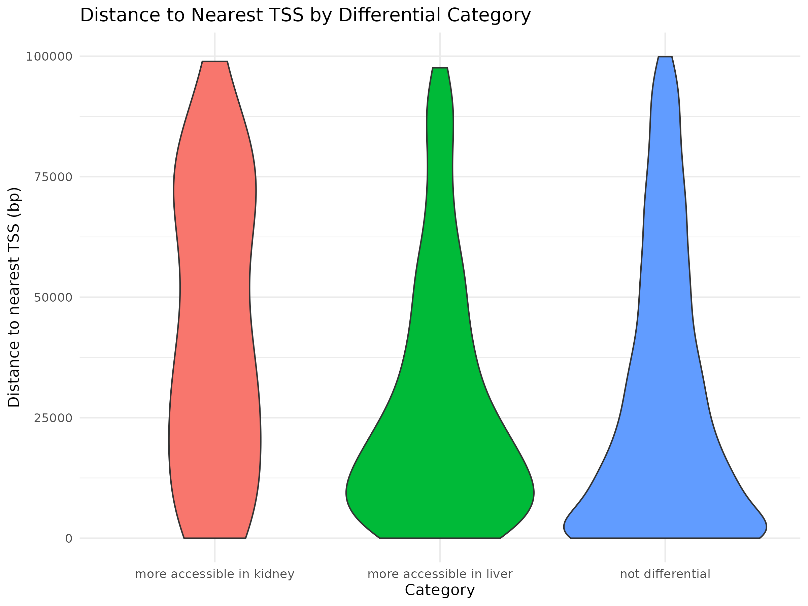

# Chromatin Accessibility in the Developing Mouse Kidney and Liver

### An ATAC-seq analysis of fetal mouse tissues, from raw reads to integration with DNA methylation, histone modifications and gene expression

**Divyashree · Ajay**
Group `atacseq1` — Mentor: Midhuna Immaculate Maran

Computational Methods for Epigenome Analysis (COMPEPIWS 2026)
Walter Lab & Müller Lab, Integrative Cellular Biology & Bioinformatics
Saarland University

---

## 1. What This Project Does

This project takes eight raw paired-end ATAC-seq libraries from developing mouse tissue and carries them through to conclusions about how chromatin accessibility differs between two organs, and how those differences relate to DNA methylation, histone modifications and gene expression.

The samples come from mouse fetal **liver** and **kidney** at embryonic days **E14.5** and **E15.5**, two biological replicates per tissue and timepoint, from a mouse fetal development atlas (Gorkin *et al.*, 2020). All data are restricted to a reduced mm10 reference containing only **chromosomes 18 and 19** (145,658,490 bp). The same panel was profiled in parallel by the other course groups with ChIP-seq (seven histone marks plus input), RNA-seq and whole-genome bisulfite sequencing, which is what makes the integrative half of this report possible.

The work splits into three stages: processing the raw FASTQ files with the **nf-core/atacseq** pipeline; analysing the resulting alignments with **ChrAccR** to summarise, normalise, explore, compute motif activity and test for differential accessibility; and integrating the differential peak sets with the methylation, histone and expression data from the other groups, both in IGV and quantitatively in R.

| Sample | Tissue | Stage | Rep | Total reads | Fragments | TSS enrich. |
|---|---|---|---|---|---|---|
| kidney_14_5_REP1 | Kidney | E14.5 | 1 | 3,053,702 | 1,526,264 | 8.22 |
| kidney_14_5_REP2 | Kidney | E14.5 | 2 | 3,531,622 | 1,765,791 | 11.92 |
| kidney_15_5_REP1 | Kidney | E15.5 | 1 | 3,462,304 | 1,731,145 | 10.67 |
| kidney_15_5_REP2 | Kidney | E15.5 | 2 | 3,892,596 | 1,946,286 | 11.34 |
| liver_14_5_REP1 | Liver | E14.5 | 1 | 1,773,908 | 886,943 | 20.76 |
| liver_14_5_REP2 | Liver | E14.5 | 2 | 4,422,848 | 2,211,394 | 26.17 |
| liver_15_5_REP1 | Liver | E15.5 | 1 | 2,832,640 | 1,416,303 | 23.71 |
| liver_15_5_REP2 | Liver | E15.5 | 2 | 1,712,552 | 856,264 | 21.48 |

**Core tools:** nf-core/atacseq v2.1.2 with Singularity (BWA-MEM, Picard, MACS2, MultiQC); ChrAccR (region summarisation, normalisation, differential testing, footprinting); chromVAR with JASPAR vertebrate motifs; GenomicRanges and bedtools; ggplot2, pheatmap, ComplexHeatmap; IGV.

---

## 2. Processing and Quality Control

The eight samples were declared in a samplesheet giving `sample`, `fastq_1`, `fastq_2` and `replicate`, with replicates of each tissue–timepoint pair sharing a sample name so the pipeline produced both per-replicate and merged-replicate outputs.

```bash
nextflow run nf-core/atacseq -r 2.1.2 -profile singularity \
  --input samplesheet.csv --outdir results \
  -params-file /vol/COMPEPIWS/pipelines/config/atacseq.json
```

MACS2 ran in narrow-peak mode, appropriate for the punctate ATAC signal, with alignments filtered against the ENCODE mm10 blacklist — repetitive, low-mappability regions that accumulate reads in every experiment regardless of biology, and would otherwise generate false peaks. Three optional QC steps were disabled (`preseq`, deepTools `plotProfile` and `plotFingerprint`) to shorten runtime. The run completed 310 tasks in 14 minutes; BWA-MEM was the most CPU-intensive step (608.7%), Picard MarkDuplicates the most memory-hungry (15.79 GB).

Reads were 51 bp and all libraries aligned at 100% after filtering. FastQC flags per-base sequence content at the 5' end in every library, which is expected in ATAC-seq because Tn5 has a sequence insertion bias, not a sign of library failure. MACS2 called 1,456–3,415 peaks per replicate, merged by the pipeline into a **consensus set of 6,259 peaks** that becomes the primary unit of analysis.



**Figure 1.** Fraction of reads in peaks per replicate. `kidney_14_5_REP1` is lowest at 0.1, still within the range normally tolerated, but all four kidney libraries sit below all four liver libraries. TSS enrichment shows the same ordering (Table 1.1): 8.22–11.92 in kidney against 20.76–26.17 in liver.

No library fails, but the kidney libraries are systematically noisier. This matters later — a signal-to-noise difference between tissues gives the liver samples more statistical power at equal depth, and is worth holding in mind before attributing every asymmetry to biology. HOMER annotation shows promoter overlap ranging from 15.4% to 31.1%, so in every library the clear majority of accessible sites are distal.

---

## 3. Signal Summarisation, Normalisation and Sample Structure

ChrAccR works from the BAM files rather than peak calls alone, so accessibility can be summarised over any interval set. Three were used: genome-wide **tiling** windows, annotated **promoters**, and the **consensus peaks**.

```r
setConfigElement("differentialColumns", "tissue")
regionSetList <- readRDS("/vol/COMPEPIWS/data/annotation/regionSetList.rds")
regionSetList$consensusPeaks <- import(consensusPeakFile)
run_atac("ChrAccR_analysis", "bamFile", sampleAnnot,
         genome = "mm10", sampleIdCol = "sampleId", regionSets = regionSetList)
```

After filtering out regions with coverage below 1 in more than a quarter of samples and all chrM regions, 276,356 tiles, 1,216 promoters and 6,256 peaks remained. Library depths vary 2.6-fold, so quantile normalisation was applied, forcing every sample's count distribution onto a common reference and pulling the two shallowest libraries (`liver_15_5_REP2`, `liver_14_5_REP1`) up onto it. These normalised values are used for **visualisation only** — differential testing runs on raw counts, because the negative-binomial model needs untransformed values to estimate dispersion, and hence biological variability between replicates, correctly.



**Figure 2.** PCA of the eight samples on the consensus peak region set. Kidney clusters tightly around PC1 ≈ −20 and liver around PC1 ≈ +20, with PC1 alone explaining **79.69%** of total variance.

The choice of region set matters. Consensus peaks separate the tissues best (PC1 = 79.69%), promoters second (71.43%), genome-wide tiles worst (28.43%, samples scattered rather than clustered) — as expected, since peaks are by construction where signal is concentrated while most tiles contain only background, diluting real signal with noise.

Colouring the same projections by developmental stage gives no comparable structure: E14.5 and E15.5 samples intermix freely within each tissue cluster. **Tissue identity, not the one-day difference in stage, is the dominant source of variation.** Unsupervised clustering of the 100 most variable peaks agrees, splitting the samples strictly by tissue with no sub-structure by timepoint or replicate. This is biologically sensible — liver and kidney at these stages execute entirely different differentiation programmes, whereas E14.5 and E15.5 within an organ are adjacent points on one trajectory.

---

## 4. Transcription-Factor Motif Activity and Footprinting

Peaks tell you *where* chromatin is open; motif analysis begins to tell you *why*. chromVAR computes, for each of 579 JASPAR vertebrate motifs, a bias-corrected deviation score capturing how far accessibility at motif-containing peaks departs from expectation in each sample.

```r
dsa <- getChromVarDev(dsa, type = "consensusPeaks", motifs = "jaspar_vert")
variability <- computeVariability(chrvarDev)
```



**Figure 3.** Motif variability across the eight samples. Variability drops sharply after the leading motifs, all far above their bootstrap lower bounds: Gata4 (9.18), Gata1 (7.80), GATA6 (7.26), GATA3 (6.72), GATA1::TAL1 (6.47).

**All five most variable motifs belong to a single transcription-factor family** — and this reflects two genuinely distinct GATA programmes rather than redundancy between similar position weight matrices. GATA4 and GATA6 are hepatocyte identity regulators. GATA1, GATA3 and the GATA1::TAL1 heterodimer are **erythroid** factors, and their prominence is a direct read-out of the E14.5–E15.5 fetal liver being the embryo's principal site of definitive erythropoiesis, so a substantial fraction of cells in these libraries are erythroid progenitors rather than hepatocytes. This reframes the whole contrast: it is partly an organ comparison and partly a haematopoietic-versus-epithelial one.



**Figure 4.** Deviation Z-scores for the 20 most variable motifs. Two reciprocal blocks appear — a HOX/POU block positive in kidney, a GATA block positive in liver. The kidney side is led by **HOXD13** and **GBX2**, developmental homeobox factors associated with urogenital and posterior patterning.

Motif enrichment identifies candidate factors but does not show they are physically bound. Samples were merged into two aggregate tissue datasets and Tn5 insertion frequency profiled around every occurrence of the four leading motifs. The characteristic peak–dip–peak shape arises because insertion is elevated in accessible flanks but blocked at the motif where a protein sits: dip depth reports occupancy, flank height reports local accessibility.

```r
dsaTissue <- mergeSamples(dsa, mergeGroups = "tissue")
fps <- getMotifFootprints(dsaTissue,
        c("MA0482.1_Gata4","MA0035.3_Gata1","MA0890.1_GBX2","MA0909.1_HOXD13"),
        samples = getSamples(dsaTissue), motifDb = "jaspar_vert")
```



**Figure 5.** Aggregate footprint at GATA1 motifs: sharp central protection with clearly higher flanking signal in liver than kidney, indicating sites that are both more accessible and actively occupied in liver. GATA4 gives the same pattern.



**Figure 6.** Aggregate footprint at HOXD13 motifs: a central dip is present, but kidney and liver traces overlap almost exactly. GBX2 behaves identically.

This is the most informative negative result here. GATA motifs are differentially accessible *and* differentially occupied; HOX/GBX motifs are differentially accessible in the global comparison but show **no tissue difference in aggregate occupancy**. The kidney-enriched signal may come from a minority cell population diluted in the aggregate, from paralogous HOX factors sharing the motif, or from a motif too degenerate for a clean aggregate footprint. Either way, motif enrichment is a claim about sequence composition of accessible regions, not about binding.

---

## 5. Differential Accessibility Between Kidney and Liver

Differential testing ran on the consensus peaks with tissue as the comparison variable; peaks were classified using an adjusted p-value below 0.01 with an absolute log2 fold-change above 3.

```r
diffTab <- getDiffAcc(dsa, regionType = "consensusPeaks", comparisonCol = "tissue",
                      grp1Name = "kidney", grp2Name = "liver")
diffTab$category <- "not differential"
diffTab$category[diffTab$padj < 0.01 & diffTab$log2FoldChange >  3] <- "more accessible in kidney"
diffTab$category[diffTab$padj < 0.01 & diffTab$log2FoldChange < -3] <- "more accessible in liver"
```

| Category | Peaks |
|---|---|
| More accessible in liver | 509 |
| More accessible in kidney | 109 |
| Not differential | 5,638 |



**Figure 7.** Volcano plot. The x-axis is log2 fold-change for kidney relative to liver, so positive values (blue) are kidney-enriched and negative (red) liver-enriched; the y-axis is −log10 adjusted p-value. The liver arm is denser and reaches far higher significance.

Adjusted rather than raw p-values are used because 6,256 regions are tested at once; at that scale a raw 0.01 threshold would return dozens of hits by chance. Liver has roughly five times as many differential peaks as kidney, but two caveats temper this: the liver libraries have better FRiP and TSS enrichment (Section 2), giving more power at equal depth, and the erythroid content of fetal liver contributes an accessibility programme with no kidney counterpart. The direction is robust; the magnitude should be read with both in mind.

Peaks were then annotated with their nearest protein-coding TSS via `distanceToNearest()` against the GENCODE mm10 annotation.



**Figure 8.** Distance to the nearest TSS by category, capped at 100 kb. Non-differential and liver-specific peaks have most of their density near zero; the kidney-specific distribution is shifted toward larger distances.

A Wilcoxon rank-sum test confirms it: kidney-specific peaks are significantly farther from the nearest TSS than non-differential peaks (p = 2.32 × 10⁻¹⁰), while liver-specific peaks are not (p = 0.9992). The promoter region set tells the same story from the other side, with differential signal almost absent (7 kidney-biased against 2 liver-biased promoters) versus hundreds of differential consensus peaks, and 7 of the 10 top-ranked differential peaks are distal. **Tissue-specific accessibility here is concentrated in distal regulatory elements, not promoters** — consistent with promoters of broadly expressed genes staying constitutively open while cell-type identity is encoded in enhancers.

---

## 6. Locus-Level Integration in IGV

Before quantitative integration, accessibility was inspected alongside the other assays at individual loci. An IGV session was assembled with the consensus peaks, the autoscaled aggregate kidney and liver count tracks, the tissue-specific differential BED files, and the ChIP-seq segmentation, WGBS signal and segmentation, and RNA-seq tracks from the other groups.

Three patterns held consistently. Accessibility peaks fall specifically on active promoter and enhancer states: at the *Eif1a* TSS a consensus peak sits exactly on `Pr_A` in both tissues, at *Gm32139* on `Pr_W`/`Pr_B`, and at *BC031181* on `Enh_A`/`Pr_A`, each coinciding with an unmethylated region in the WGBS segmentation. Promoters sit in unmethylated regions while the gene bodies immediately flanking them are highly methylated even when the gene is strongly transcribed (*Tmed7*, *Eif1a*) — the gene-body methylation pattern, in which promoter hypomethylation permits initiation while gene-body methylation accompanies rather than represses elongation.


**Figure 9.** *Kcnn2*, unexpressed in both tissues. The promoter is unmethylated and accessible (`Pr_B`/`Pr_W`), the gene body highly methylated (`Het_P`, `NS`). H3K27ac is flat while H3K27me3 is clearly enriched — a bivalent, Polycomb-poised promoter.

*Kcnn2* is the clearest demonstration that no single layer suffices: an accessible, unmethylated promoter would predict expression, and only the H3K27me3 track explains the silence. *Epb41l4a* is the converse, with all four layers agreeing — kidney-biased expression, the strongest local DMR (score 0.704) on the UMR at the TSS, an active enhancer state (`Enh_A`) in kidney against a bivalent `Pr_B` in liver, and a kidney-specific differential peak upstream.

---

## 7. Chromatin States, DNA Methylation and Accessibility

Moving from anecdote to quantification, average DNA methylation was computed within each of the 15 ChromHMM states by intersecting each tissue's WGBS bedGraph with its matching segmentation.

```r
hits <- findOverlaps(kidney_meth_gr, kidney_states_gr)
avg_meth <- combined_df %>% group_by(sample, state) %>%
            summarise(mean_meth = mean(meth, na.rm = TRUE))
```


**Figure 10.** DNA methylation within each ChromHMM state, split by tissue. Methylation is near zero at active promoter states, intermediate at weak-promoter and enhancer states, and high at transcribed, heterochromatic and quiescent states.

The extremes are `Pr_A` (0.009 kidney, 0.014 liver) and `Tx_S` (0.898, 0.812), and the emission matrix explains what defines each. `Pr_A` is characterised by strong H3K4me3 (1.00), H3K9ac (0.97) and H3K27ac (0.94); `Tx_S` almost exclusively by H3K36me3 (0.88) with every other mark near zero.

This pairing is the mechanistic core of the report. Active promoters are held unmethylated because CpG-island promoters must stay accessible to the initiation machinery, and they carry acetylation plus H3K4me3. Strongly transcribed gene bodies are the *most* methylated compartment and carry H3K36me3, deposited co-transcriptionally by elongating Pol II, which in turn recruits DNMT3B — so high methylation there is a consequence of transcription, not a cause of silencing. Comparing tissues state by state, the differences sit entirely in inactive chromatin: kidney is more methylated at `Het_S` (+0.24), `Het_P` (+0.22) and `NS` (+0.22), while all four promoter states differ by under 0.02. **The two organs differ in their repressed compartment, not at their active promoters.**

The WGBS group's "mystery regions" correspond exactly to the ATAC consensus peaks, so the two measurements can be joined region-for-region. ATAC coordinates are 1-based from `GRanges` while the WGBS table is BED-style 0-based, so the start was shifted before exact matching; 5,720 regions matched one-to-one.

```r
wgbs_gr <- GRanges(wgbs$Chromosome, IRanges(wgbs$Start + 1, wgbs$End))
hits_equal <- findOverlaps(wgbs_gr, atac_gr, type = "equal")
```


**Figure 11.** Methylation against accessibility across 5,720 matched peaks in kidney (Pearson r = −0.748, Spearman ρ = −0.767). Liver shows the same inverse trend more weakly and with wider dispersion (r = −0.523, ρ = −0.500).

Two features matter. The near-identity of Pearson and Spearman coefficients indicates a close-to-monotone relationship not driven by outliers. More importantly, a large fraction of peaks sits at essentially zero methylation while spanning the full range of accessibility — **low methylation is permissive for open chromatin but does not determine how open a region is.** Transcription-factor occupancy and nucleosome positioning set the actual level. The weaker liver correlation fits fetal liver being the more heterogeneous tissue: averaging a mixed hepatocyte and erythroid population blurs a relationship that holds within each cell type.

---

## 8. DMRs Against Accessibility and Gene Expression

Of 6,145 tested regions, 3,254 were significant DMRs at FDR < 0.05. Overlapping these with the heterochromatic states (`Het_P`, `Het_S`) puts 329 (10.11%) in `Het` in at least one tissue, so most kidney–liver methylation differences occur *outside* heterochromatin. That count alone does not establish enrichment or depletion, which would require comparison against the total genomic footprint of the `Het` states.


**Figure 12.** DMRs overlapping tissue-specific accessible peaks, split by methylation direction. 538 DMRs (16.53%) overlap a differential peak, and the bars are almost single-coloured within each peak type.

The directional result is the strongest single number here. Of the 538 overlaps, **535 (99.44%) are inverse**: all 76 kidney-specific accessible peaks overlapping a DMR are liver-hypermethylated, and 459 of 462 liver-specific ones are kidney-hypermethylated. Where a region changes in both assays, the tissue with open chromatin is essentially always the tissue with lower methylation. This is far tighter than the global correlation in Section 7, because conditioning on regions differential in *both* assays selects exactly the regulatory elements where the layers are coupled, filtering out the constitutively unmethylated peaks that flatten the overall correlation.

Finally, each tested region was assigned to its closest transcript and related to expression. Note that gene assignment was run on all 6,145 tested regions rather than the 3,254 significant ones, so the counts below describe the tested set as a whole.

```bash
bedtools closest -a dmr_sorted.bed -b genes_sorted.bed -d > dmr_closest_gene.bed
```

The 6,145 tested regions map to only 1,681 unique transcripts, and 1,297 of those carry more than one region — the extreme case 59. Collapsing transcripts to genes and joining with the expression table leaves 1,045 genes with both measurements. **Differential methylation clusters around particular genes**, suggesting coordinated regional remodelling over extended domains rather than isolated CpG-level switches.


**Figure 13.** Mean methylation (left) and mean log2(CPM+1) expression (right) for the 30 genes with the most DMRs, in the same row order. *Slc14a2* and *Trpm3* are near-white in the methylation panel yet deep blue in liver expression — a large expression difference with essentially no methylation difference.

Spearman correlation between gene-averaged methylation and expression is significant but weak: ρ = −0.099 (p = 0.0014) in kidney, ρ = −0.120 (p = 0.0001) in liver. The weakness follows directly from Section 7. Averaging across a whole gene mixes promoter CpGs, where methylation is negatively associated with expression, with gene-body CpGs, where it is positively associated; the contributions partially cancel, leaving a small negative residual. Separating the two compartments would be expected to recover a much stronger promoter correlation.

---

## 9. Summary and Interpretation

**Tissue identity, not developmental timing, structures the data.** Kidney and liver separate cleanly in every exploratory view, PC1 explaining 79.69% of variance on the consensus peak set, while E14.5 and E15.5 samples intermix freely within each tissue. Over a single day of gestation, organ identity determines the accessibility landscape far more than developmental progression does.

**The differential signal is distal.** 509 peaks are more accessible in liver against 109 in kidney, but almost none of this appears at promoters (7 versus 2). Kidney-specific peaks are significantly farther from the nearest TSS than non-differential peaks (p = 2.32 × 10⁻¹⁰), and 7 of the 10 top-ranked differential peaks are distal. Cell-type identity is encoded in enhancers while promoters remain broadly open.

**One transcription-factor family dominates, for two reasons.** The five most variable motifs are all GATA-family: GATA4 and GATA6 reflecting hepatocyte identity, GATA1, GATA3 and GATA1::TAL1 reflecting the erythroid progenitor population that makes the E14.5–E15.5 fetal liver the embryo's main site of definitive erythropoiesis. Footprinting confirms genuine differential occupancy at GATA sites but *not* at the kidney-enriched HOXD13 and GBX2 motifs, where aggregate profiles are indistinguishable — motif enrichment and factor binding are different claims.

**Methylation and accessibility are inversely related, but conditionally so.** Across all 5,720 matched peaks the correlation is moderate to strong (r = −0.748 kidney, −0.523 liver), and many unmethylated peaks span the full accessibility range, so low methylation is permissive rather than determinative. Restricting to regions differential in both assays tightens this dramatically: 99.44% of the 538 DMR–differential-peak overlaps are inverse.

**The methylation–expression relationship depends entirely on genomic context.** Active promoters are unmethylated in both tissues (`Pr_A`: 0.009, 0.014) and carry H3K4me3, H3K9ac and H3K27ac. Strongly transcribed gene bodies are the most methylated compartment (`Tx_S`: 0.898, 0.812) and carry H3K36me3, with methylation there a consequence of elongation rather than a cause of silencing. Averaging across whole genes therefore yields only a weak negative correlation with expression (ρ = −0.10 to −0.12). The tissues differ mainly in their heterochromatic and quiescent compartments (kidney higher by 0.22–0.24), not at active promoters.

**No single layer is sufficient.** *Kcnn2* is the clearest case — an accessible, unmethylated promoter that would predict expression, silenced by H3K27me3 and identifiable as inactive only once the histone track is included. *Epb41l4a* is the converse, with methylation, chromatin state, accessibility and expression all pointing the same way at one locus.

### Limitations

The analysis covers only chromosomes 18 and 19, so genome-wide generalisation is not warranted — and these two differ markedly in character, chr19 being gene-dense and euchromatic while chr18 is gene-poor. Two biological replicates per condition is the minimum for dispersion estimation and limits sensitivity for modest effect sizes. And the kidney libraries have systematically lower FRiP and TSS enrichment than the liver libraries, so the 509-versus-109 asymmetry is partly a power difference rather than a pure statement about biology.

### Possible extensions

The most immediate improvement would be to split methylation by compartment — promoter, gene body, enhancer — before correlating with expression, which the Section 7 result predicts would substantially strengthen the promoter-level relationship. Beyond that: computing gene activity scores directly from accessibility and testing them against the RNA-seq differential table; running ChromHMM jointly on histone marks, accessibility and methylation for an integrative segmentation richer than the histone-only model used here; and single-cell ATAC to resolve the hepatocyte and erythroid components of fetal liver that are necessarily blended in these bulk libraries.

---

## References

Gorkin, D. U. *et al.* (2020). The dynamic landscape of open chromatin during mouse embryonic development. *Nature* 583, 744–751. https://doi.org/10.1038/s41586-020-2093-3

nf-core/atacseq — ATAC-seq analysis pipeline, v2.1.2. https://nf-co.re/atacseq

ChrAccR — Analyzing chromatin accessibility data in R. Overview vignette. https://epigenomeinformatics.github.io/ChrAccR/articles/overview.html

Schep, A. N., Wu, B., Buenrostro, J. D. & Greenleaf, W. J. (2017). chromVAR: inferring transcription-factor-associated accessibility from single-cell epigenomic data. *Nature Methods* 14, 975–978.

Buenrostro, J. D., Giresi, P. G., Zaba, L. C., Chang, H. Y. & Greenleaf, W. J. (2013). Transposition of native chromatin for fast and sensitive epigenomic profiling of open chromatin, DNA-binding proteins and nucleosome position. *Nature Methods* 10, 1213–1218.

Klemm, S. L., Shipony, Z. & Greenleaf, W. J. (2019). Chromatin accessibility and the regulatory epigenome. *Nature Reviews Genetics* 20, 207–220.

---

*Data generated on the de.NBI cloud within COMPEPIWS 2026. WGBS, ChIP-seq and RNA-seq inputs used in Sections 6–8 were produced by the `wgbs1`, `wgbs2`, `chipseq1` and `rnaseq1` groups and shared through `/vol/COMPEPIWS/groups/shared/`. Full commands and intermediate outputs are documented in the accompanying workshop notebooks.*
